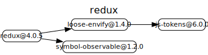
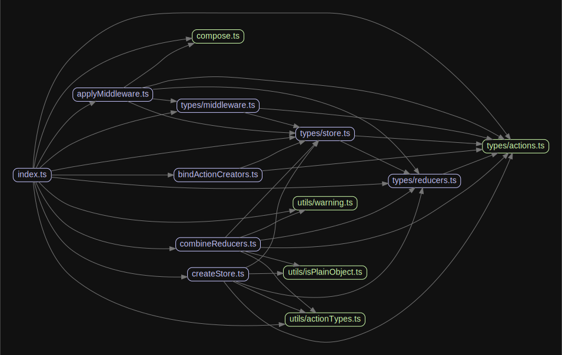

# 源码分析

## 文件结构

``` bash
├── src
|  ├── applyMiddleware.ts
|  ├── bindActionCreators.ts
|  ├── combineReducers.ts - 提供combineReducers方法，用来组合reducers
|  ├── compose.ts
|  ├── createStore.ts - 主流程，用于创建store
|  ├── index.ts - 入口文件
|  ├── types - 一些type和interface
|  |  ├── ...
|  └── utils
|     ├── actionTypes.ts
|     ├── isPlainObject.ts
|     └── warning.ts 
```

## 外部模块依赖



## 内部模块依赖


  
  
## 功能点分析


### Redux的工作流程

![https://awps-assets.meituan.net/mit-x/blog-images-bundle-2017/adc95a4c.png](data:image/png;base64,iVBORw0KGgoAAAANSUhEUgAAA0wAAAF7CAYAAADhfQuLAAAgAElEQVR4XuxdB3RURRu9SSCB0HuR3rsoCtItiKCCNEGlKTZABQQpKhbERrOABWyggCBFVEQQsFAFEVBAMPTea2jp+c8d/gkvyya72X277+3uN+d4JLtT78zON3e+MmGpqampkCQICAKCgCAgCAgCgoAgIAgIAoKAIHANAmFCmGRVCAKCgCAgCAgCgoAgIAgIAoKAIOAcASFMsjIEAUFAEBAEBAFBQBAQBAQBQUAQyAABIUyyNAQBQUAQEAQEAUFAEBAEBAFBQBAQwiRrQBAQBAQBQUAQEAQEAUFAEBAEBIGsISAapqzhJbkFAUFAEBAEBAFBQBAQBAQBQSCEEBDCFEKTLUMVBAQBQUAQEAQEAUFAEBAEBIGsISCEKWt4SW5BICgQOHfuHHLlyoVs2bIFzHjOnz+PnDlzBlSfAwZc6aggIAgIAoKAICAIZIiAECZZHIKAAwLffvstpk2bhilTpiAyMhI9e/ZEq1at8Mgjj/gNq0uXLuHChQsoUqQIwsLCXLa7Y8cODBo0CK+++ipuvPHGTPPrvG+99RZq1qzpsm53Mpw4cUKRmdy5c4NPu40YMQInT57E+PHjER4e7k4VmeZhna+//jqOHTtmWp1ed0oqEAQEAUFAEAgYBBYuXIiPP/7YaX9Lly6NNm3a4K677nJL5mY0aMqq4cOHg5eSZsm/gAE4yDsqhCnIJ1iGl3UESJimTp2KL774Io0w3XHHHejTp0/WK/OwxMyZMzFjxgxF2goUKOCyFk2CXn75Zdx0000Z5udm3rdvX0RERJi2mV+8eFGRyubNm+OZZ55RhGnw4MGK3LD/bMuMdPDgQdX3Z599FrfddpsZVUodgoAgIAgIAiGCAGU7ZRIv9woXLpw26rNnz4IWDEy8GG3fvr3HiGjCxEtEkjOz5J/HHZKCpiEghMk0KKWiYEHASJhIVpKTk/2+6c2fP18RtunTpyM6OtoltJowjRw5Etdff32G+Tdu3IhXXnkFL774Iho0aOCyXncyJCYmomvXrmjdunU6LRwFhzvaMXfaYB4tiLZv365wofZPkiAgCAgCgoAg4A4CmjA5k5OrVq3CqFGjULx4ca+IjpEwTZw40RQLC3fGJnl8j4AQJt9jLC3YGAFubl9//TV++ukndSCnSv7y5cvQhIVkhWr1G264AS1atFB5vv/+e8yePVvdSPGm6uGHH1YmeyQHP/zwA3izVLt2bXz44Yc4c+YMqOofOHAgKlasqJBgHUuWLMHcuXNx5MgRVUfDhg3Ro0cPFCxYEHPmzMG8efNU/VWqVMG9996LW2+9Vf39/vvv488//1T18LsnnnhC/V8Tpl69eql/r1ixQuV58MEH8cADD6i+ac3Pvn370hGO+Ph49fcvv/yi2uDNG80SOnXqlEYUM2qbhPKNN97A7t27FbHjuDnW7777DjQrZH/YNv9NPHS/SpUqpbRFtWrVUv2k9uidd95R/V29ejV+//13pKSkoGPHjujevXsa8dKEb8iQIWjSpImNV5Z0TRAQBAQBQcBOCGjC5MwSgxd/3bp1U/JvwoQJiuhQZs6aNUvJdZrIU1499NBD6UzZKRs/+ugjUDbRJL1Lly74+eefERsbCxImyrwFCxaoi0r6DTMdPnwYo0ePxlNPPYXKlSurzyhDx40bhwMHDih517hxYzz22GPqTMDEdj7//HMsW7ZMXRbSkoSWHUWLFlXfU27++uuv6gwzadIk5MiRA2PHjlX9+uSTT9RZg/VStj/55JN+vwS20zrwtC9CmDxFTsoFPALcDHnT9Ndff6nNg4SG2gsmBkPg5sSNiSp6muRxk/nmm28UueCmWrduXSxfvhwJCQlKw9K5c2dliqbrqFSpEgoVKoS1a9eqOrl5kdxoO2q2SSL033//4dChQ+pmixsvN9nFixerMiQhJBEkayQfJHP0O8qePTv+/vtv1W9qougvRB8mJm6K9erVUxsltWMkHPfff78ib6yD5I5jYTJiwDFRO8UNnmO65557VD6a3GXUNskS/abi4uJUu8WKFVPjfO2119JM8kjIuPFT4LDvJUqUwNKlS1X7xKtp06YKA5IgnYjTrl27VP+JLYUQE9shsaxRo4YSQGZqsAJ+QcsABAFBQBAQBDJEIDMNE4lKv379lN8wZTBly9ChQ5VsohyvUKEC1q1bp+rWFhq8CNSyjXl4XiAxYeJFKYkXLw+1ib82r9fyThO3nTt3qotGpkaNGmHv3r2KVOXLl0+ZEJJ8URZT/vFcQfm/bds2Jf9p9sezgx6bHnyZMmVUGfZVnzVYhvVSvo4ZM0bkZxZ/K0KYsgiYZA8eBLh5cEPkxkbtRlRUlNocn3/+eTVIEhFqf3hAJ2GiNocHfGpo6F9EUsUNjGSCmyW1Py+99BI2b96siBB9bbjpLlq0SBEhkgUSDPr50L/nq6++SjO3I8EgwWGb3FS5yX755Zfqv7x586oNl1otTWLYP2rBPv30U3VLxc2chIm3Te+++y7y5MmDo0ePKr8ramL43ZYtW/DCCy8oYqK1M9r/qFy5cmkbKDU7vGnjbRk3Y2rgMmv79ttvT2eS52iSQILJ8iR+/I9pz549Ckviw7FRWLGP7Dc1Ufnz51dCgwKMvlGaDLJujoEaKTP9o4JnVctIBAFBQBAQBJwhoEkFLxRJPHiZR7l/6tSptEs8BmyoX7++0ti8/fbbysLj8ccfV7JKyy1qfSgbaQ1C+UatDomTtjL57LPPFIkh8XJGmIw+x+wL5RtJE88j1CwZLzIpD2mNQu0RSRXPFky8dKT1iz4T6LHReoMBkthHfcH7wQcfgARK18vLVp4tKG8luY+AECb3sZKcJiEwa9XJdDV1bnzF+dIXn9csE42apZ37AOkNhmpwrRZnP0g4qDnKiDBRg8RNrmXLlqhevbradHiDo4nC1q1b04gP69OBFqgt4SbLTZraHqrMqRnijRQ3LzqeasJk9KMieSC5oMZFEyjWy3p+++03VK1aFUlJSWrT1Robfk8yR5U9b6nYLk0JSTIczREYzYeaK5og0JyQ7UyePFndtLEcN/HM2iZJM2rhHJ1eWZ7mBow8aPTHojCi9s2oITMGdHDsf2YYOy7Nfw9cSpt3X6wrvWZN+klINYKAICAIuI3Ax8/NSJe3z9grF1Gh9vlfi7fgppZXzLrdSY5aGMcyJDwkOSQ7jPS6YcMGpaEpX768srqgzCYZ4aUpLVCopSH5oWzjd0y8cKQ8JBFzhzDxDMH8lPNGnydeeFKjRV9jXrLSZJAESVtV8O/nnntOESOjfDdGv9WEiSSqQ4cO6tKW8jqrgSiI87rFm9PgCtX1JoTJnV+Z5DEVAR5g7XDgJDGi+ZnjTYv2X3IkTFRvUxPCGygSHp1oykZNCM3Z+F1MTIwiHPr2xlHjwk2QGy03YGPS5nXUMDkSJtabWdQdZ2HFNeHQNtm86XIkTOwbb8mo5XFM1LxxgybByqxtbSanzRYdCZMu7+gAS7tw4mQkTMaw6I791zbl9H2iMNHk0tTF6UZldlm/bnRVsggCgoAgIAj8HwFNmHixSCJC0sHEC0daa/CilBehtNqgJcO///7rFDvKavoFkbBQztP0ThMZR3nvSsNEvyhtxaJN5Y2NajnIS01nSZvt8ULU0fSPJoO0aqHVi07sO61iqDkTk/as/TSEMGUNL8ltAgJ2OXDSrI7hu0mcaNKmEzcdbqzOCJOO/EatEDdTBkrg/2meRzLCKDs09TOSMJah9oc+PPTvoeqeGzU3x2rVqqFkyZIqPwNPZKRh4ubteJNFjRVvwGhOR+0U2zBqjxwJB83iaD5gzKNtqUmqaHZAksR/U9OjNWIka5m1TYFh3PAdCRPL04SO5Eg/lKtNA7QZovbByqz/mjCxPkctngnLUqoQBAQBQUAQCGIEMgv6wEtBmt0z2itloSZMlEnUylBmMVF2UzbSKoWEiZeoxqitRnmfkYbJ6MOkNUysj9orTWIo02nNQu0WCRw1Vzw/GEkOZTw1W2XLlk13yap9pViGcpNWJDyX0MyQl8Tsv5nvMAbxklFDo+aWWjUhTME+0zK+DBHQPkC8bWnXrp3Kp0kGtT+OhIl+PTRxY0Q77VPDMtq0jCp6mvfxNscYtlv74lAdTmJBEzXaPHNTZtIqfEbB0URLa5i4EdOPisEp1q9frzRTdNhkYrQctkeNCwNWuCJMJHbsl9GHSavs6UPFIBZMJIOs87rrrlMaJm7imbVNm2qOS4cVdyRMvOFieSMxpe8Ux0/hY/RhcpcwOWrxZJkLAoKAIBAqCOgDXKiM16xxZkaYHC8YSXbof2y0eqCspl8wNTe8AHzzzTevkY06gIPRh4lynZHr+BnlI8vRHJ3yjpFlaZLHM4fRtI9R9FauXKm0V8xPQsdLWfo0M2mCp32UHZ9Dyeg9RF7y0t/azKdFzJofu9YjhMmuMyP98hsCjDxDssSNiiG0uXFRLU9tiDaPcwz68PTTT6sbJUZto3MmyRE3Q+bjBsrIbfyMt0DMq22i2QY3KKrfSbp4w8PvGe2G5eh0yrzU7JCAaCLDiDmMvsfyJDrsF2+bqJ5nXx2j5BkJB0mJto2mjbPeYKmK500ak77pIjl69NFHVQQd9of9Y9AHEjWSmsza1pEEqT1iUAcSJ+LA9ih0qA3ibR37OmDAgLRIesePH097JNDZw7uO/Wd5mk5wTIzGZ1WUH7toSP32Q5GGBAFBwFYICGHybDoyI0yO8obyiVYglMuUjSQ7tEghIeLDtpRDOpCSlsuU5yQ4lNfapJ2WI5TVtNxgSHKeD+h7zEQ5SX9o3S9qsnr37q18lxhNV78JReLEy1HKZBI2+i/TJJAkz1iHo0meDhbFNiibec7geYVBp0jgdEhyz9AMnVJCmEJnrm03UjsdOLn5DRs2LM2fiBsSI95Ry0LiwA2QBIehuLlBMj8P/9yodCJR4A0Qgy/QXMxoL6zzUANDUsbEiDfctHRitB6+qcDNmOp1mgrSqZQaIxKXO++8Uzl96of1dDlu0ozox4g++lbL+CCfjuDHTVer8rkZs7/UHGkCQg2ZftuJddOGmzdo3KSbNWumzA4ya5s3WYwySI0XhQtx4+ZOkwL9ngXfVWIeY2Koc2rtWMad/tO0QOfz9jV2b34Udlq/3oxDygoCgkBgIiCEybN50096GLVGuiaSEMoVms5rczXKcgZ/MPobMyosfZYpj5j4piLlnE407+fFIwMtaLmrNUrMQ7nLyK+Meqf7QRlK7RHfX9SJl5i8ZGU9TPRRohWLMZE88YKSyegTrE3yaLXCOmjlYkw8B9x9992egRiCpYQwheCk22XIdjtwkpToR934RpDeCDPCi/n5bhLz8d8M16kfhiVh0j5MJCwkHiRgJGLGRO0WA0fwITvePDHRzpibqc7LulkHI8tpu2Vu3NTckMgxil1WnTZ1KFKa2dWpUyetS7xNo9aKkXroRMrE/lFzpqP/uGqbYyUmOr8jfqyfgoTCgWNmW1lNNFMguTMG1chqHd7mt9v69XY8Ul4QEAQCCwEhTP6bL30+oMylvHaU5ewJiQnlN/PQ+sFZooylfGcdGclIXQ/lLs8Njoky9vTp06odfq99gl2hQblLc0LKcPpMZ9S+q3pC/XvxYQr1FWDB+IP1wJlRWHELIM6wSe0vxU2Tt15ZJVxWjkU/vEuzBmqnrErBun6twlPaFQQEAUFAEBAE7I6AECa7z1AQ9i9YD5wkTPRL4m2OVSGv3Vku2l+IPkA0IwyU9N577ynTQP1ocKD0W/opCAgCgoAgIAgIAoGJgJjkBea8Sa9tjgBN++g8yqh1dtbekNQx2o4z8wK7QkyTBgaY8MSUz65jkn4JAoKAIJBVBMQkL6uISX5BwHMEhDB5jp2UFAQEgRBGIFg1pCE8pTJ0QSCgEBDCFFDTJZ0NcASEMAX4BAZy9+XAGcizJ32X9StrQBAQBKxEQAiTlehL26GGgBCmUJtxG41XDpw2mgzpSpYRkPWbZcikgCAgCJiIgBAmE8GUqgQBNxGQoA9uAiXZzENADpzmYSk1+R8BWb/+x1xaFAQEAUFAEBAErERACJOV6Ido23LgDNGJl2ELAoKAICAICAKCgCAQQAiISV4ATZZ0VRAQBAQBQUAQEAQEASIgJnmyDgQB/yEghMl/WEtLgoAgEEQIiIY0iCZThiIIBCACQpgCcNKkywGLgBCmgJ26wO+4HDgDfw5DeQSyfkN59mXsgoD1CAhhsn4OpAehg4AQptCZa9uNVA6ctpsS6VAWEJD1mwWwJKsgIAiYjoAQJtMhlQoFAZcISNAHlxBJBrMRkAOn2YhKff5EQNavP9GWtgQBQUAQEAQEAesREMJk/RyEXA/kwBlyUy4DFgQEAUFAEBAEBAFBIOAQEJO8gJsy6bAgIAgIAoKAICAIhDoCYpIX6itAxu9PBIQw+RNtaUsQEASCBgHRkAbNVMpABIGAREAIU0BOm3Q6QBEQwhSgExcM3ZYDZzDMYuiOQdZv6M69jFwQsAMCQpjsMAvSh1BBQAhTqMy0DccpB04bTop0yW0EZP26DZVkFAQEAR8gIITJB6BKlYKACwQk6IMsEb8jIAdOv0MuDZqIgKxfE8GUqgQBQUAQEAQEgQBAQAhTAExSsHVRDpzBNqMyHkFAEBAEBAFBQBAQBIIPATHJC745lREJAoKAICAICAKCQJAjICZ5QT7BMjxbISCEyVbTIZ2xAoHNmzdj1apV2LFjBy5cuGBFF6RNNxDInTs3KleujMaNG6N27dpulPBtFtGQ+hZfqV0QEAQyRyBYCZPIZHuvfLvJYn+hJYTJX0hLO9cgYIcD57Rp07Bz5040b94c1atXR968eWWmbIpAbGwstm3bhmXLlqFSpUro1q2bpT21w/q1FABpXBAQBCxFIBgJk8hkS5eUW43bTRa71WkTMglhMgFEqcIzBKw+cHJjvnjxIrp37+7ZAKSUZQhMnToVuXLlspQ0Wb1+LQNfGhYEBAFbIBBshElksi2WVZY6YQdZnKUOm5BZgj6YAKJUkTUErDxwUuU/d+5cDBkyJGudlty2QWD06NHo2LGjZeZ5Vq5f20yCdEQQEAQEARMQEJlsAogWVWG1LPb3sIUw+RtxaQ9WHjgnTpyIqlWrokGDBjITAYrA2rVrERMTg969ewfoCKTbgoAgIAgIAkRAZHLgroNQkcVikhe4a1R67gUCgwYNwuDBg8VnyQsMrS5KO+oxY8Zg3LhxVndF2hcEBAFBwO8IBJNJnshkvy8f0xoMFVkshMm0JSMVBRICTz75JN59991A6rL01QkCzz77LCZNmmQJNlZqSC0ZsDQqCAgCtkIgmAiTyGRbLa0sd8ZKWZzlznpYQAiTh8BJMe8RsPLAKZuz9/Nnhxqs3KStXL92wF76IAgIAtYiIITJWvyl9asIWCmL/TUPQpj8hbS0cw0CVh44hTAFx4K0cpO2cv0Gx+zJKAQBQcAbBIQweYOelDUTAStlsZnjcKcuCfrgDkqSx1QErDxwCmEydSotq8zKTdrK9WsZ4NKwICAICAI+QEBksg9A9WOVVspiPw5TNSWEyd+IS3uWRsmTzTk4FmAobdLBMWMyCkFAEBAErkVAZHJgr4pQkMVikhfYa1R67yECsjl7CJzNioXCJm0zyKU7goAgYBMExCTPJhMh3UAoyGIhTLLQQxIBIUzBMe1WbtJikhcca0hGIQgEKgJCmAJ15oKv31bKYn+hKYTJX0hLO9cgYOWBUwhTcCxIKzdpK9dvcMyejEIQEAS8QUAIkzfoSVkzEbBSFps5jszqEsLkL6SlnZAhTLt27UKdOnWwatUq1K1b1+nM79y5E9dffz3WrFmD2rVru8xTuXJlNG/eHH369MHDDz8cdKtpxowZKF++PG655ZYsjc3KTVoIU5amSjILAoKAyQgIYTIZUIfqzp8/j6SkJBQoUEB9s2/fPtSoUcNpoy1atEDbtm3RvXt3REZGetWxefPmYejQoVi/fj3y5MnjVV3+KmylLPbXGHU7EvTB34hLe0Eb9GH79u244YYbsGLFCtx4442ZkiF383CTbty4MZ544glQOxZMSQuhd955J8tjs3KTFsIUTKtQxiIICAJWImBHq48ePXogJiYGq1evRkREBPRFZ+7cuXHXXXelwXXx4kUsWrRI/d27d2+MHTsWYWFhHsNJwkTZ9vfffyN//vwe1+PPglbKYn+Ok20JYfI34tJe0BImTi1vpbJly5bhLGstVGaEyZgnGAkThQG1cGPGjMGJEycQaIRJfsKCgCAgCAgC5iBgR8L03HPP4cCBA5g5c6YiQJowffjhh9dYehw9ehT33HMPTp065TXREcJkzpoyuxYxyTMbUakvIBBwd3P+448/8MMPP+D+++/HxIkTMX36dDzyyCN4+eWXsXnzZrz++uv4888/1W3QSy+9hKioKHDj/OCDD9CrVy9UqFBB4UFiQELA7+69917Ur19fqe+NhCmzPM4IU2pqKmbPno2PP/4YW7duBW/D2Gb16tXVrRiJyIABA1CrVi3Vhy+//BIbNmzAkCFDcN1116nPPvnkE1y4cEHlS0xMVOObOnWqGhNNDLp27YqOHTuq2zWSQI63adOmOH36tBIY2qRw7969eP/991V9HNujjz6Kzp07Z2iawL63a9cOS5cuTVsvQpgC4qcjnRQEBAGbIBDqJnmZyaR169bh+eefB2U4NUJvvPGGkpFGc7mM8oSHhystEWX+5cuX8cADD2DgwIFKRtKUPiNZxTMA5adRM0TtFGXjjz/+qGTeY489httuuy1tBVEWfv311/jss8+QnJyMvn374tKlS3jttddUPTlz5lTnjdtvvz2dVuurr75S5Kx///5gfynHKfPZb6aePXuqcwnN+ZkyOy/we55NXnnlFdX+Tz/9pM4CK1eudFvDFQoaJiFMNtn4pBv+RcBdwsSbnm7duqnO0R+pVKlSauPTiX5F3FBJMLQqfseOHelM8pi/S5cuqgh9kEhwdNKEyVUeR8LEzY8kh5ssN1KaAI4bN05V+9tvv6Fw4cLKN+rVV1/F4MGDERcXp3ygtmzZokjW3XffDdpnN2zYEPfdd58SJtzsKQhIlLihs+49e/aoejk2mh00a9YM//33X1r/SZhSUlLQqFEj9Rk3TY6f42Eb9E3KSNNGocCy27Ztw6233hpwGiYxyfPvb1ZaEwQEgfQIhDphykgm0cybMrdIkSJK/vHgz4vPVq1a4ZtvvlEySctcZ3lIFp566imlWWLiJSDJEy8OSZicaZhIpkis6HekCRPL8/KQbdCcnsSIMtVIuLTcZR7KTF5sMvFSk+eK7NmzK7nraI5PYkPLDLZB+c5zAOU7ZTVJ4fjx41W77Eu+fPkyPS9wfNqVQK8w3b67JoFCmGR3EgR8iICVB86sEqYRI0Zg0KBBCo3HH39cEQFubJ06dVKaF2qN6JzJzYsbIjdVkqGqVauqzY7k5Pfff0fJkiXVv6m658bqbh5HwkSicscdd6TbeKnlYT+oYZo2bZpqgzdPvC06fPiw+lyTGmqKNm3apAjTzz//rAhXgwYNVF8pDGh+QDJDIlOsWDE1LgoEki62w42f7TMPN/ndu3croqY1V9ysebuXmcmhXlra9DDQNExWrl8f/iylakFAEAgQBEKdMOmLQKNM0heBJAtz585FwYIF1WxS80INCi8MaSVB2ZdZHso1muSRfM2aNSudSR6tQ9q0aYP4+HhFTqjdoXUFLxM1mTp58iTKli2rLDT4XY4cOVR+nj14FiCROXbsmPJzZp5PP/1UWaiQuLRs2VL1mXlYzpn/su4bCSDlMes1ylBNCHnpmzdv3kzPC8ZzC2U4y1apUiVLvwIhTFmCSzILAllDwMoDZ1YIEzeCv/76S2ltmLhRzZkzR5nk6Qg2xs2L5EETJm5U/Dc3NGpydCKR4G0X/+9OHkfC9OKLL+K9995TG2+5cuUUmeHGSnM7mrlxo6VpALVDJEa8qWL7vEnirdTGjRvVTdvw4cPTbsNiY2PVTRXJEjd72ms/88wzuPnmm1XehIQEtXGTWH300UdqKDpgA00dSMIoEHh7Ry0TN313SJC2C3cnr+MKs3KTtnL9Zu2XJrkFAUEgGBEQwhR3jUzSmhJaSDz44INp037o0CFFAihnaEHBS8LM8vCMQPly8OBBdWFoDPqQ2VriBWSTJk2wYMECZZZOAkXZS0sUymieHVgvZT/lJy1Y/vnnH1SqVCmtWsrtCRMmuEWY2DfKaV6MGs8klMXLli1TYyYZc3VeoMznWcURE3d/N1bKYnf7aFY+CfpgFpJSj9sIWHngzCphMtoka8Lk+Bk3PxILI2GiyQCJkWP4cE00uGm6k8eRMHFz4q2Vs6TV8GyDpnLLly/H4sWLlfMqBQj7w4111KhRiuB88cUXShPFmzdnIct5+zVlypQ0wsTNWefTZCejSX/rrbfQr1+/TNeEECa3fzKSURAQBASBoETAXZlsHDwv+HiJ50wmOcpcrY2iny+tI5w962HMw/4YL0IpI7WsolyjSRzlp04kJ/R1Zn8WLlyoTAC1Ob+zCaNFBuX/pEmTlG8x/ax0ItmiSaC7GiZelFLea2Ln7GLR1XlBE6bMnjrJbOEJYQrKn6UMyi4IhAJh4o0SNTS8VWrdunUa9P/++6/S9nDDdCePkTDRlpkOqNwAWZ4EiT5NTNQ00UyOt1X0EaI2iLdb1DqRuNCMoESJEqCJIUkQTRS4yetbOfovvfDCCyhdurR6e4IOqtQsGTVMRltqXY5207QVZ16dSARpzqdNIjJad4FKmOzyO5J+CAKCgCAQ6Ah4Q5iMMknLE2pcaEKuk/H5Ck2YMsuTGWFyZg1BGUwZr03zaQ7IAFGTJ09WJoCUzUw04SfRomXI999/r4I2rF27Vv2tE03qtfWHNskzkkK2RUJFaxHKZroLLFmyBAxiwSARuh1qrsqUKYM333zT5XmBpuaQfu8AACAASURBVPHaMiaj51BCnTBJ0IdA32Wk/x4h4O7m7Cy8Z1Y0TIUKFVIP3fH2ZeTIkWlvM2iTOhIed/I4apio5uetkvFxXBIlapDOnDmj1PM0jdPtECTeHDFiHh1TaaPMGy29UdNGm5s7Iwrx0V0mRs3hQ7L0Y+Kmz03e0ZaaUXrq1aun8mhNlW6LQslRIDmbLCFMHi1hKSQICAIhjoCY5F3RMBkJkyZGlLk0E9dJ+/TQkqJmzZppcjmjPJn5MGVkPm48G1CukbDRfJ0R63RiBF36U1H20tSfZntGk32t5aJ/EzVMOugD5TYvJZlIbihftbk8Lz55gcrzgDbt02b/PMPQRN7VeYF+YEKYMt9QhDCF+IYbqsP3hjBxI+YmZDTJ07bOjiZ5tJOm9oU3RsxDFT3L6k2am5o7eRwJE8lMxYoVFemhzTG1RrRTZjvGCD60p+7QoYMKxqBfDecGzo2XTq98bI/ESmuKGPaUt1W09+aNFm+wSIiojWLACmfOp9qZluPk+Lg5k3y5G2UnUAmTlRrSUP3dyrgFAUHgKgJCmK4lTNS+GGUuo9SRmNCMvHz58koLQ62NO3moxaGmiBoamqZrs7WMCJPxbEDZTPN3XkIyPy8faenBEOGsi5eQtAKhHGagKEbPJWGhPP3222/TItyxrzrCLeshISL5YYAJXQ8JFM8RtDZhvbTu0FECeU4hCXN1XtBy2J1ATc5+g6FgkieESXZfyxCw8sDpLmGaP3++IhAMmqDDa1JTxIAKRrtjanJIOkiYuPlRS6O1P4yg8/TTTysfISZupCQUdOrkLRO1Pq7ycJPkpsmw5Np/iGZ93BTZnk4kYvpdBn7GWyqa5dFUgESKdthU09O36e2331akiEm/Z8F3HHSinTY3XtbJGyya9Dn2QZelkyrfjdApK5F29I2g402cOwvTyk3ayvXrDjaSRxAQBIIbASFMV57LMMpFzjiJCLU9OkQ3P6MJPMOF8+LP3Tz0/W3fvr3KT58jmpjz8tJZWHHmIbHiEx06cMLZs2eVjCUB0okXmCzPYE9MJDs0m9dynBeUJDckdrQK4XmBsp5Rb3mBycRIvTwz0ASel5mU6yRmNKnXieSJrgA33XST+sjVeUFHqzVarWTl12OlLM5KP73JK4TJG/SkrFcIWHngdJcweTVAh8JHjhxRvkb0DdJ2xo71u5PHWIYP3ZEUUUsUHR2dznHUk77zBo3ChuRQb+jc9HnLxf8ySzTPo9keTQi4WfsjWblJW7l+/YGttCEICAL2RiDUCZOr2aElBi/9KJPol8sIsI7JVR6SEvof5cqVy1VzGX7PNkhq2A/Kf8fEC8vjx4+rj4sXL67yOiZG2SNJoqx3Vgfzs6+Uw8zDqL6O4zX7vGDso5Wy2OOJ8bCgRMnzEDgp5jkCVh44rSBMniMlJTNCwMpN2sr1KytCEBAEBIFgQkBkcmDPppWy2N/ICWHyN+LSHqw8cMrmHBwLMJQ26eCYMRmFICAICALXIiAyObBXRSjIYjHJC+w1Kr33EAHZnD0EzmbFQmGTthnk0h1BQBCwCQJikmeTiZBuqKBWfFMqmJMQpmCeXRlbhggIYQqOxWHlJm2lhjQ4Zk9GIQgIAt4gIITJG/SkrJkIWCmLzRxHZnUJYfIX0tLONQhYeeAUwhQcC9LKTdrK9RscsyejEAQEAW8QEMLkDXpS1kwErJTFZo5DCJO/0JR2soSAlQdOIUxZmirbZrZyk7Zy/dp2QqRjgoAg4DcEhDD5DWppyAUCVspif0+OBH3wN+LSngR9kDXgNQJWbtJCmLyePqlAEBAEBAGFgFxiBvZCsFIW+xs5IUz+RlzaE8Ika8BrBEJpk/YaLKlAEBAEBAGbIiCEyaYT42a3QkEWiw+Tm4tBsgUXAoMGDcLgwYPTHmcNrtGFxmhiY2MxZswYjBs3LjQGLKMUBAQBQcCAQDCZ5IlMDtylHSqyWAhT4K5R6bkXCEycOBFVq1ZFgwYNvKhFilqJwNq1axETE4PevXtb0g0xybMEdmlUEBAE/o9AMBEmkcmBu6ytlsX+Qk4Ik7+QlnauQcDKA+fmzZsxd+5cDBkyRGYmQBEYPXo0OnbsiNq1a1syAivXryUDlkYFAUHAVggEE2ESmWyrpZWlzlgti7PUWS8yC2HyAjwp6h0CVh84p02bhosXL6J79+7eDURK+x2BqVOnIleuXOjWrZvf29YNWr1+LRu4NCwICAK2QCCYCBMBFZlsi2WVpU7YQRZnqcMmZJagDyaAKFVkDQE7HDi5Qe/cuRPNmzdH9erVxacpa1Po19y0k962bRuWLVuGSpUqWUqWOHA7rF+/ToA0JggIAoKAjxGws0w+dfEoth//Bw3L3+VjFOxdvd1ksb/REsLkb8SlPdscOGkKsGrVKuzYsQMXLlwImpnJWwWI3R40w0Hu3LlRuXJlNG7c2DIzvOBBU0YiCAgCgoA9EbCrTC7cAIg/AZzfbU/cjL2i/I87ASScMb+voSqLxSTP/LUkNQoCtkBg5I9P4qV7J9miL9IJQUAQEAQEAXMRCDaTPHPRMbe2P/f8gh3HNqPrLQPMrdhHtW06uAYrdizAI42HIjoyt49aCa1qhTCF1nzLaEMIASFMvp1sMcnzLb5SuyAgCGSOgBAm/6yQUxeOYeKyV/F40+Eomvc6/zRqQiu/x/yAI+f24cH6z5hQm1QhhEnWgGUIyIHTt9ALYfItvrJ+fYuv1C4ICAJCmOywBmau+wBlClZGo4qB57v07YbPkCsqD+6q2cUOUAZ0H4QwBfT0BXbn5cDp2/kTwuRbfGX9+hbfQKr9zJkzyJ8/P8LCwgKp26b2NSEhASdOnEBqaipy5syJQoUKmVp/qFR27tw5FXzInbUkGibfr4p1e3/Hf0c2oHvDgb5vzActJKckY/KqUahT6hbUL3+7D1oIvSol6EPozbnlI5YDp2+nQAiTb/GV9etbfAOl9h9++AGTJ0/GV199hTx58ljWbUb7HDhwIF599VXceOONfusHCdL8+fPx2WefpWuTjuHsz0033ZT2OQkVyRS/czeRQCQlJdmCgBn7z3GPGDECJ0+exPjx4xEeHu7ukDLMl5iYqKJ/tmnTxvIooF4PJggqOHPpBD7+/VX0ajwUxfOVCdgRnTh/BFNWj0L7Gx5DpaK1AnYcdum4ECa7zEQI9UMOnL6dbCFMvsVXahcEeJh/+OGH0alTJ3Tt2tVSQP777z/1EPfLL7+cjqT4ulMLFy7Exx9/rDQiPOhfd911WLlyJRjpjOn1119HnTp11Jt3PXv2VE84PPOMez4VJCVPP/20IiVff/01IiIifD2cDOt37D/7NnjwYBw7dgxTpkwxrW9Lly7FhAkTMGnSJBQvXtyy8UrDwKy/PkLJ/OXRpFLrgIcj5ug/+HHTVDzSeAgK5ioa8OOxYgBikmcF6tKmIOAHBIQw+QFkaSKkEfj888/x448/4pNPPkGRIkUsxyI5Odm0g7s7gyFpGDRoEPbs2aNIk/GA/+233yoi0bJlS0V6qD0hqWzdujUeeeQRd6pXeV588UVFmCZOnOiWmZrbFWcxY0b9JwbumM+521xcXBx69OiBGjVq4JVXXsm0bjHJcxfVrOdbv285thxah56NBmW9sE1LrNm9BNuObFCR8yRlHQEhTFnHTEoIAgGBgBAm306TaEh9i6/da6fGgQf/G264AcOGDVMHW5rn0Wyrdu3a+PDDD0HfptKlSyvTtIoVK6ohrV69Gr/++qvSxlCLkCNHDowdO1aVnzVrlqqD78HVqlULDz30EGrWrKnqfOedd9S/STr0Af3s2bMYM2YM6tWrh4YNGyrixu/5sDPT2rVr8cEHH4CaMK0B4mE8MjIS8fHxGDlypHrXjCSGiYf/qVOn4vTp0+jXr58yMzt48KAiQ1pjxLH1798fRYsWVVojYkD/LRIao1kav+vVq5cyD2SeN998E7t370Z0dLTCh0SLfZo+fTp++eUXnD9/HoULF8Zdd92lNHbsy7vvvqvwSklJQdWqVdG3b1+UK1dO5SVZ5SPWHAvN/qi9Yp8ySsTwiy++wJo1a0BiyXnp0qULmjVrllaE9b7//vv4888/1WdVqlTBE088gQIFCuCNN95I13/O6XfffYdLly6pcXIs/DfnfcWKFap8qVKlVJ85l0x87++3335TeM+ZMwfUCjI999xzah50onnnvHnz1PrIbExCmHyzS5y7fEqZ4vVoOAgl85fzTSMW1frT5ulITE7AfXXdv7SwqKu2a1YIk+2mJHQ6JAdO3861ECbf4ivr17f42r12HqppbqZN4LSJ1vbtV16LJmlh4AOSFiaSIh7AteZFj69MmTLqkP7888+rAzTLVKhQAevWrVNZqGG5/vrrFSGgluPLL79M85Wi79Cnn36qDvVsz2iSp7+jGdudd96JTZs24fDhw+oATnJDwkQic8cdd+DJJ59UbekxxMbGKpKkSQ8DOvBAz7///vtvRVLot0VfJBKCQ4cOoVGjRujcuTM4nmzZsqWbPpIuEgxqT0gsihUrpvB477338NdffymixDGSaLCte+65B48++qgqs3fvXlUX/cNeeuklVZb9ZV0cc/bs2bFt2zalWXPUculO6LGSiJJ0FixYUBExEifi26BBg7SxXr58WeVhvRwr6yVZom+YY/9fe+21NJM8tvHYY48pssvyJUqUAM3rmGi617Rp03Rzz3pJovV6efvtt5VWiUn7o3Fe77333gx/CkKYfLNLzFk/CcXylkLTyvf4pgGLa5225l2ULVQlaMfnK3iFMPkKWanXJQJy4HQJkVcZvCFMPHjx5nru3Lno0KFDun7wAFO+fHl1E00HZTMSDy40u+Fh0fGwZUb9vqhD1q8vUA2cOmfMmKE0QloLQLIxfPhwpYm59dZb8eyzzypysGjRInz00UfqEE0tCzUHNFWj9oGESx/eeWDm4fjxxx9X5WjmxoM2vycRoCaGWokXXngBt9xyiyI3bGP//v2qPvrSUGtDAle5cmVFOKKiohQZIyHRGpvff/9dEawWLVoo0y9HwsQxUBtDUsXDPPcCEhSSGCZNxN566y01JhI7aqqMidobEqjbbrsNJUuWVF85mrRpnyBqjLjXcMzUJHFPIRHjmKmx0v0hzsxDkkUNHckUcWYiMWHgBfZRkz9jf7R/F7Vv1CoxcR+jFk2X4X42e/bsdHXosT711FO4/fbb05kU6vnWWHF+WP7BBx9U/zHpOWS/Wf9PP/2k5urmm29W80jSpNcH55J4MWnNHbVfNGfMKAlhMn+/2Lh/Jf4+sFr5+gRrOh93VkXOu6N6B9QseXOwDtNn45KgDz6DVirOCAE5cPp2bXhDmHhA4CGPt9FbtmxJ55+xY8cOdVNOUx/mMyPxQFO9enX88ccf6jAYCEnWbyDMkm/6yMMyD7xctzTzosmWPkBv3bo17TO2zs+pheGlAEnA999/rw7NmnDoaGsbNmxQ2g5eRlDLQlM9Eqp9+/ap+qi54O+N5mckRUeOHFHkgKZ41E7xd6kJEwkHic4DDzygzPp0oqaHfSFJoMbKXcLEgz2JDLVAJDj82+i3Q40UNTb8/VKTxbHqxAAP1HBpEmAkaDQVpEaHxIjEY9euXUpzRX8w7bNEnE+dOqWwI+nSmjYSJN0Hfk6zNk0uHYNDEGNeyLAd9oPt0jSPhEiTVJJTtk8NHsN6M1FrRBM6mgNyLzRq5IyEiX0bOnSoMtmbNm2aMjvUiUSYWkbOIeti/caADo7EjeWoyeI48+XLp8ZtZbAL3/yC7FlrbNwZTPz9VTzUoD9KFahgz06a1Kt9p7Zj+tr3lD9TiXxlTao1NKoRwhQa82yrUcqB07fT4Q1h4s0rIzUx8YbTeDjxBWHSWiuawPBQJkkQsDMCzsiR/iwmJkYd+nWIcUdNBP1eqG0wEi2Sgn///dfpkHlYZl76CZHskFhQm8HodPxcR6EzEiYetEmeqPkx/p70QZzaEncIEwkJyR21YsZE0sN9gX0jWeJYjQSKpn/UnHCsNN+jTw7JipGgERdqzIiFY6KGivsP6zRqvEgk2W+SLGeJ43YWsY7Eh1os7ZtkLKsJk24nI4KigzFowudImEhitbbJ6Mulw85rwmSce/ZDzxv7Qc0fk9a+0fyQOJgRstzOvye79G3uhk9ROHdxNK/Sxi5d8mk/qE1bu2cpHmk0FFHZc/q0rWCoXEzygmEWZQyCgBMEvCVMPHjQ5IY3sbw95k22FvCOGiY6S1MjRcd0Rsqi03bv3r3VTTFvtekDwHDDdI6nyR0PG+PGjVM+FTRDoQM3b947duyonL5pliRJELArAplpmOhPY/Qz0pHkqCHSGqaMCBMP3dRksAwTNSfU1vD3RvKgQ3hTo0TzLx7QSc74m3JGmIxmXqzPqM3QhMkYtc7ow2QM4sBgBjQvo/kdowKSuFB7xYAO1GRR+0T/JWNyxIjvLxkJkzaTo7kgf+8kSfw3+8wxaw2TkTCRKFHLQ9M9HShDt0lCQ61c2bLX3pZ/8803imRSO8c9hkSEdZCAMoof2ydpJYbUELEeJvaDmj9q1UgKHQmfkWTx39zr9HywPDEgad24cWOahskdwuSuhklM8szbIf45sBqMjNeryTDzKg2Amn7Z9i1OXjiKLjf3DYDeWttFIUzW4i+tCwI+Q8BbwsRDEs1caCpHJ3Sa5vHQ46hhYiSwJk2agKZIjBZFvwkeDHnw++eff9ThhIczHhR409y9e3d189y+fXvlZ0G/At54M/G9FpoL0dfD7kk0pHafId/2j+uZARyc+TDpQAJGkmL0YXI8NPOygRoZ46OzPND36dNHRV7TWhP+1ni4J2FhMprcGQkTiQe1xIyeRxKmtT/GIBG8qCD5YMADaqOYGGyApmnaJI6kjO8fMbCEjtZ29OhRpQnh75SXG2yH39FXKleuXGmgU6tDE0Ka01G7ogmTJmiaxDBwQt26dVU5mhmSxPByRWu4jT5MzMOLGBJFYqJN5/g3+8R9iGMhPiRX7A+1YNp8kmRI95ER9nhpw32Ib2mR2Kxfv15pokhQmXQe9on+UiRMuv+OGiZeCrE8I/txv2SipojzReKrfZiyQphIIrV/l7PVLITJnN/4hfhzmPj7CHS+uS/KFLwSYTKU0uz1E5E/Z2HcWaNTKA07y2MVwpRlyKSAWQjIgdMsJJ3X4y1h4m00tT50sqaDtfZZciRMo0ePVvb7dMTWTstLlixRN7e6DP0HeGBk4g0s/Rp4qKG/A/0/eFCjo3ogmeTJ+vXt+rV77fowbYySp4M+kKDQZI3/p6aEa12TKJIsx0Oz9kdifl4iUEs7c+ZM9bvggV6/W6Q1Fows5xgVzkiYSJRIHFie/+YlBQ/zbJcmciQOTNq8jeZg9J0iMaJ2gwd1muHyEoT9JiHib5aaLAaCYfskISRbJBq6PyQt7Dt9gRgQg3XxoVr2RfswsQ4GRSCpoKaM5IhjpraZewO1OvTBYr3MQwLHsbVt21YFoOGeQaLDPCSUJGYMp862+G4Rx6vJmA6QQSxJ/BiI4u6771ameTSVY+K+RM0354DaMuJKokfCRTy0SSRx4zzo/pM4sT1thkesdCCHAQMGpEUCPH78uCrHeXQ2985M8vR6cPRBc/xNCGEyZ5eYt/Fz5I8ujNuq3mdOhQFWS0JyPKasGo16ZZujXtmrYfYDbBg+764QJp9DLA1khIAcOH27NswgTNQE8bDHgxEPKiRRPLTxcEUyxIMOv+O7LTTd44GP3/NGlbb+PIzQ/4GHDkbn0oSKI2d+lmXSJIwmPzSbCYQk6zcQZsl3faS2hxpVHuR5IDZGyXNslZoJmqkyGX1aeFmgE6PrjRgxIk17xM+pedXvIel8NO/iQV1rrLT2SIei1loqaqZI5nTYapanWdmoUaNUhD4mtsk8OkgDtckkIPz9ah8i/s55AWJM7BcJFH/XSUlJyhxXh9DW+fS7T8SG+YgPTXZJNPndZ599prRzRr8iXrKw3ytXrlTvI1HDraPIsV5NgHiRQzNeYyJ50u9JEWPWr8ksSQ3JELVdOpG0MYw5zehI3GhyzHeSiI9O7De/q1+//jX9J7kjceNbWNrPiHscx2hM999/vzJZ1O90UTPGvuu512aSjN5HbbteI+w/L6u0tsrZShbC5P3ve9PBNfhzzy94rOmL3lcWwDUciz2AyatGo8vNT6F84WoBPBLfd12CPvgeY2nBAQE5cPp2SZhFmOhwzEMNyQ1vPGlCo32YNGEimXKW+PYII0PpAxP/5qGEZiq8FdZJCJNv14LU7hsEqF0l8afPEjUe1DBpHyZqPHj4Z6h8fudOInGhdoFvANF0zN1ymdVNzQ37wTr5RpIxOAPLUZNCH0RqThhlzlkiOWRwB5Ij5jESPZ2f37PvJEY0v6PmyNkTAewL9xTtJ0QNDPvAoBYM2sDE9liHzsNLG5I4o8kf6+FFDcfl+BwB+0AzO5IoHXWTnxEL/p8mi6ybeDNiHk37dF/ZFgkW66VpoiNejv13xItjMbbDcWUlEWOSTJoyZ2aOl5U6Ja9zBC4lXFAP1Haq94R6lyjU07Yj6/Hzv7NU5Lx8OZ3vBaGOEccvhElWgd8REMLkW8jNJEzsKc1WePvKgwhvSXnzzH/z9pWHw19++SXd4cLRCZtEiT4GOhnN7wKRMPl29qT2QECAB2teGvCA265dO0WYHMOKB8I4gq2PNH2jCR61NFklLFZjoR9ENj5ka3WfgrX97/+ejNxR+dR7RJKuILBq50LsOrEVPRpe8WuUdBUBMcmT1SAIBCkCZhMm3vrSXI5vjTCRMNEZmrb59I9gWGTthK19lvr376/MaHRZRgpjOUbUchZIIpB8mIJ02ciwsogAD+f0CaJ/EM2+qF3QIcOzWJVkNwkB7jfUGOnQ7iZV6/NqGOiDfmXVqlVTvmOukpjkuUIo4++3HPoTq3f9jCeaveR5JUFacv4/X6nLz3vrdA/SEXo2LCFMnuEmpQQB2yNgNmHigBnWmE7TmjDROZo+CYwgxdfrGeqXJi0kSrxppzM4Qw/TAZ5+Dnx3hWF96VDOPPQxoN+GfriWGis+xhkIj9eKhtT2PwG/dJAmXgcOHEDJkiWVKReDG1SsWPEaUy6/dEYaCWgEtNkgTQEZZMJVEsLkCiHn38clXlKmeO1ueATlC1f3rJIgL/Xl6nGoXLQWGlW6K8hH6v7whDC5j5XkNBkBOXCaDKhDdd4SpmPHjmHGjBnpHk2kQKdWiZG/6LdBZ3YmBnZgBCtj4nstDD3MN5waN26stEo0k6E/E/0RGACCZnoMPU6fqBYtWqi/GVqcn9k9yfq1+wxJ/wSB4EZACJNn8zv/ny+RM3sutJAw2hkCePbSKUxeNQqtaj6A6iVv9AzoICslhCnIJjSQhiMHTt/OljeEyZOe0Rlam8I4OmG7Wx9v5/mOkzNncXfr8Fc+Wb/+QlraEQQEAWcICGHK+rrYemg9lu/8Eb2bv5L1wiFWYveJbZj918d4uPEQFMt7JbKmJAn6IGvAAgTkwOlb0P1NmHw7GvvVLuvXfnMiPRIEBAFBICME4pPiMPH3V3Hv9d1RsciVdwElZY7AX/uWYeO+FYo0ZY9wbSYaCnhKlLxQmGWbjVEOnL6dECFMvsVXahcEBAFBQBAIHAR+3DQVkRFRaFmzc+B02gY9Xbx1NmIvn1Hh10M5uTTJO3cuBtu3T8X+/XNx7twlJCWFMlzmjz1bNiBfvmiUKdMRVap0R758Vc1vRGoMSQSEMIXktGd50Kn79iF1wQKkLl8GHDwIxMVnuQ4pkAkCOaKAUqUQ1qw5wu65B2FlywpcgoApCIhJnvsw/ndkI36L+U6Z4oWFhbtfUHIqBGau+xBF85TE7dXahywimRKmVat6IyZmIQoXjkTevBGIjo5ARERYyILli4EnJ6fi0qVkxMYm4+TJBFSt2hqNG0/0RVNSZ4ghIITJtxMeDBrSlLffRur8+UgoWgjxeXIjKVc0UiMifAtciNUelpyMbBcvIer8BUQeP4WwNm0QPmxYiKEgw/UFAkKY3EM1MTkBE5e9ila1HkTlorXdKyS50iHAyIIMAtGwYkvULd04JNFxSpguXTqMhQvvQEREIkqWjBKS5KelQfJ0+HA8kpOzo3XrXxAdXdJPLVvTTDAcOK1Bzr1WhTC5h5OnuQJ6/Z44geRnnkZiXBwulCgiJMnTRZDFciRPuY+cQPYcORAx4QOgSJEs1iDZBYGrCAhhcm81/LT5a4SHhaNVrQfcKyC5nCJw+OxeRZq6NxyIMgUrhxxKTgnT3LnVERWVhBIlokIOEDsM+MiReMTHZ0PHjtvs0B2f9SGgD5w+Q8W8ioUwmYels5oCef0mP9AFcfGXcem6Er4FSWp3ikD0oSPIEZUTETO/EYQEAY8REMLkGrrtR//Bkm1zlCleRHg21wUkR6YI8MHf32K+xyONhiB3jnwhiVZa0Aea4Z04sRSlS+cISSDsMugDB+JQpEiLoDbPC+QDp13WSWb9EMLk21kK1PVLM7yENX/gfKnivgVIas8UgTwHjyLyloZinifrRBAwCYGjsQdAbVKvxkNVjckpScoU787q96NK8etNakWqWb59Pg6c2YWuDQakgbHn5DZEZcuJkvnLBT1AijAxwMPcuS1Rq1ZuMcOzeMppnrdlywV07Lg4aANBBOqB0+KlkWHzCzZNw+ZDa5WNcfMqbaAJ07LtP+CPXUtQ67r6uLdOd7t2X/rlBwQY4CHloYdwpk51McPzA96ZNUHzvAKbtiH8668lEITFcyHNBwcCDOzw3d9foP0Nj6Jq8bpYtGUmUlJTcHfth4JjgDYaxXcbv0BUthxo/X9sP1vxBhKTE9Hn1ldt1Etzu5LOJG/duuE4cuQbXHedmOKZC7NntR06FI8SJbrg5ptf96wCKRVSCCQkxWHs4kHqBfOklETQSTNn9mhki8iOSwkX8VzLcYjMJprjkFoUmLuj+QAAIABJREFUDoNN+egjxC9ZhAtiimeLZZD70BFE3dkK4X372qI/0onAQkBM8tLPF6PgbTq4BtnCs6vQ4SRMNMWT94PMX9epSMXklaNQs+RNKF+kOj5f+bbyExva6n3zG7NJjekIE32XChVKRZ48Yudph/k5fz4Jp06FBb0vkx2wDpY+UEDQxvhy4kU1pDCEIUdkNGqVrC8OryZPciBqSOm7dD4yAol585iMhlTnCQLZY88jT0Ky+DJ5Ap6UgRCm9Itg3sbPsP/UTiSnJiExOQm3VWuLG0o3RvYIUQL44udy6uIxFQSiSJ6SOHbuIFKRgkebPI/CuYPTNzYdYfrii7JijueLVeVhndosr1evfR7WYO9igXjgtDeigNYy0XZbJzq6inbJ/JkLxPWb3KQxztQWczzzV4NnNSqzvM3bELFylWcVSKmQRkAIU/rpn7J6NA6d2aPM8CLCI1SQh6TkJISHh6NljftRr2zzkF4vZg2e1isHzu7EjqObsevEVpy9dFK9bZUjW040rXw3GlRoYVZTtqonHWH65JOyqFdPbh7tNEPr15/HE08IYbLTnNi9Lz//+w3+ObAa8Ulxysb4+tKNcFfNLnbvdsD1LyAJ00034fQt9QIO62DucME16xHx11/BPEQZm48QEMKUHtgPfh2OM5dOpH2oTfEqF6uDFtU7IF/OQj6aidCqdtziQUhKSVIm/zxnxCdeBk30wsMj1DtXnW/qE9SAqKAPQpjsN8dCmOw3J3bvkdYyRYRFIDk1WbRLPpowIUw+AjbEqhXCFGITLsP1GQKjFvVDQlK8qj9H9mgUiC6C1rUfxHX5y/uszVCteP2+Zfhzz684H38OSE1VxIkpX86C6HfHW0ENixAmm06vECabTozNu0Ut0+ZDf6L2dfVFu2TzufJn95JFw+RPuN1qSwiTWzCFZKYfN01VpmQSrMf19CcmJ2D0ov4KK5ri3V6tHeqWbuy6oOTwCoHdJ7dh1c6FyhSSYcUvJVxQl7RR2XN6Va8dC4tJnh1nxdCnYCZMNoc+oLvH2573lgzBgDtHK7M8SYIAERDCZL91IITJfnNilx69vfAZ5Y9zY5mmigA4Eicxybs6UycvHMXHv7+i/GdIMiX5F4Hj5w9hxY4F2Hp4PR5q0A8Vi9T0bwf80JoQJj+A7E0TQpi8Qc+9sps3b8aqVauwY8cOXLhwwb1CksvvCOTOnRuVK1dG48aNUbt2bb+379igmORZPgVB0QEhTEExjT4ZBN/Q27h/pfIXoalZvbLNcFvV+9KIk7eEKdhkX0ROIPmy+VNhN9mjR2jH+QuPAlKuWEXaJpk1f7YjTH/+GYu+fQ+gSdNIjBtbKcsP6F68mIzklFTk/X9o9PHjD+Do0QS8/noFhIeH2WYC3e1IMBMmOxw4p02bhp07d6J58+aoXr068ubN6+7USD4/IxAbG4tt27Zh2bJlqFSpErp16+bnHqRvzg7rN6sAiIYpq4j5Pr8QJt9jHMgtjP35WcT936me1gIkTyROt1a9D18Mm4c+Yx/0aHgi+9yHzW6yhz2X+fP//NmKMKWmAkOH7sSvv16hp99+WxFlymTNnOj553dh794ETJ9eTRGkkSP3YP/+BEyaVEUIk/vryy85rT5wcsO5ePEiunfv7pfxSiPmITB16lTkypXLUtJk9fr1BE0hTJ6g5tsyW3McxvJbS/q2Eak9aBCIjIhCRER2JCcnIu8vDT0iTCL7PF8OdpA9Mn/Wzp8tgj4cP5GAu1vvSENi4MBCeOih4llCZsyY/Th6NB5jx1ZGWOAplK4Zq2iYsjT9bmemKnvu3LkYMmSI22Uko70QGD16NDp27GiZeZ4QJnuth0DtjWiYAnXm/NPvzDRMnviniuzzft6slD0yf9bPny0I07ffnsCbbx7Hxx+XxoQPDuPc2VTMmlUVUVHhaQhRC7VgwUmMH38cp0+nolHDSDz8SHFcf31uTJ58GLNmnUNcXCpat86Fnj1L4O+/z6u/27cvkkagFi8+jbFjj6ry1apHoG+f4mjUKL9qg6Tt448O4f77i+Kvv2IxbdoZVf6554qhTZvCfidhQpi8/3E4q2HixImoWrUqGjRo4JsGpFafI7B27VrExMSgd+/ePm8rWBoQDZP9ZlIIk/3mxC49WrZ9PjbsXwE+RO7Mh8mTfors8wS19GWslD0yf9bNn21M8pKSUtHr0RhcOJ+K2bOr4YsvDmPSpLP46qtyqFEjl0KIZGnChAP46qtYNGwYiTp1olUeps8/L4O5c0/gp5+uePzVrhWBl18pi2nTjqYzyZsw4SC+/PKcKt+0aV5Mn34ahw6l4NlnC6Fr1+LYu/cyOnXanTYj7dtHY9myy4pcvfFGcdx1l38fPgtmwuT9sve8hkGDBmHw4MHis+Q5hJaXpF35mDFjMG7cOMv7EigdEMJkv5kSwmS/ObFLj3wRJU9kn/eza6Xskfmzbv5sQ5hiYi6ha9c9GDKkMDp3Lgb9d8+e+fDMM6UUQjt3XsIDD+zBnXfmUEEcIiLCcOBAHNq334UePfKiX7/SoEnekSPxGDfuikme/nvs2ErYsycOXbrsVnmffrqU8mmKi0vBsOd3YeWKBHz3XUWkpAAdOuxShGv8hErIkycbDh+OR9u2O9G3bwH06uVfW3MhTN7/OJzV8OSTT+Ldd9/1TeVSq98QePbZZzFp0iS/tWdsSEzyLIE96BoVwhR0U2ragBZsmoY7a3TK8B0mT6LkiewzZ3qskj0yf9bNn20Ik9b8TJ1aDpUqRePChSR06bID2bIDs2dVRa5cEVi06BSGDz+aTutE6DZuPI+cOcNRrVoujBq1D8eOJYAEiYTISJhoisfys2ZVQIUKVx/VWr36LPr1O6TqzZ07QhEmmgXefPOViGkJCSno2TMGJUpkS6vXnClzXUswEyYrD5yy6bhee4GQwyqhRWysXL+ezo1omDxFznflhDD5Dttgr1kIk3UzbJXskbOLOXPuyfzZgjBduJCMrl23K9M4Z+mjj0qjfv28+OWX0xg16ijmzK2SFjbcMb+RIDkSpt9+O6PKz5t3hYDpdPBgHNq125WOME2bVk4RMCNhKlcuEm+84d/w5EKYzPlxONYim45vcPV3rZ5semb1UQiTWUiGdj1CmEJ7/r0ZvRAmb9DzrqxVskfOLt7Nmy7tzfxZGvRh1aqz6N//EGh+V7VqdBoaJ08m4J13TuG++6IxfHh5/PrraQwdeuSacOM01YuMDFchyF0RphEjjmDed1VQqGD2tHaWLz+LgQPTa5iMvlNawySEyZyFqmux8sApm465c2lVbd5set722cr162nfRcPkKXK+KyeEyXfYSs3XIiCyz5xVYZXskfmzfv4sI0z67aW//07AN99URoECV4lMSkoqHn9sOw4cTMaMmZXx37aLiliNHl0Ct99eUKF26nQi7mq53S0fppUrzyli9M4716FZsytR8Zj4uO2cObGYObMSGHyCJnlCmMxZlJnVYuWBUzYd38+vP1qwSmj5Y2y+aMNOhOlsfDwuJCQiIjwMBXPkQFTEVa2/L8Zu1zqFMNl1ZoKzXyL7zJlXq2SPzJ9182e5SZ4OqKC1SI5vJ82ffxIjRhzDm2+WQNOm+ZUv0e7dKXjttWIoVSoH3nrrAHbsSFEEp3r1XHj99T1YsuQSBgwoihZ3FsCkiYdVEAj6NMXHp6YrX7duHhWinJH2OnfOjSFDymL//rhrCNPly1d8mEqVEh8mc5aq9bXIpmP9HJjRA6uElhl9t6IOOxCmU5fjMGL1Gsz8b3s6CF5qWB9PXl8bkf8nTucTEpCUkooCOaKsgMpvbQph8hvUQdeQmORZN6VWyR45u5gz557Mn+WEiX5JNLMzBlkwwqEJVcuWVyLjnTyViP79dimSpNPIkcXRqlUhFRVPB3Dgd5Mnl8WiRadx+nRimu8R6xswYLciXTp16ZIH/fuXUmZ9Oure11+XR5UqV8wDaZL32OPbUaliFIYPL6eCSfgrBbMPk78wdNaObDpWom9e255sema1bqWG1NMxWE2Y4pOT0fbb+dh4/DgeqFYF91Qoj9iEBLyyag1OXr6Mh6pXxTu3NUN4WBge/3kpdp45h6VdOiAiGF4hz2DShDB5upqlnBAm69aAVbJHzi7mzLkn82c5YfJ06CRBTIxqR6JjTImJqcq0jpHzMkrUOjFPdK6IdP5MnvbHV+UCmTD9uGkqWta4P8OQqFYeOGXT8dWK9W+9nmx6ZvXQyvWb0Rhc/easJkz/nT6NZjPm4LXGDdG7bu20YVCb1On7n3Dg/Hms7toZ+aOi8MKK1Th4/gK+vLsl/HdFZdbqcL8eIUzuYyU50yMghMm6FWGV7JGzizlz7sn8BSxhMgcy+9cSyITJ1aN7Vh44fbnp7Nq1C3Xq1MGqVatQt25dp4ts586duP7667FmzRrUrn314GjMbMxTuXJlNG/eHH369MHDDz9s/4XrZg+XL1+OhQsXIjIyEgULFkSHDh1QunRpN0sDnmx6blfuIqOV6zejrrn6zVlNmOZu34k+S37F4vvbo27RIumGMX/nbgxdvgoLOt6Hb3fsxOeb/kVcUhI6Vq2Mfjdej9J58uDwhYt4e+26NHO+Z26siz51a6NwzivPRKw7egyL9+5Du0oV8e76jcidPbvSWIWFhWHejp349J9/EXP6NB6sXhU9alZH1YIFzFoOHtcjhMlj6EK+oN0JU1xcHBo3bqz26W7dutl6vlasWIEjR47g/vvvV/uFq2SV7PHl2cVxzIEwfzwnzZgxA0lJSYiIiMC9996LG2+80dX0eXV2sCzog8tRhXiGQCZMy7b/gI37VyIpJQkJSfGoV7YZbqt6X5rGycoDpy83ne3bt+OGG24AN+CMfriaDLmbp0aNGkrwPPHEE2DfgyF98MEHGDp06DVDWbx4sRqrO8kqocW+Wbl+M8LG1W/OasK07dRpNJ85ByVy58KE22/F9UWLIF9UZLrhJKWkoN+vyzAnZof6vF6xYnj/jubIHh6OBtNmqs8G16+HS4lJ+HDjP4os/f5ARxSNjgZJ16M/L02rr33livjoztsxbPkqfLllK5qXLoXrixTG+A1/qzwLO7ZDveJF3VlqPssjhMln0ErFThDwpezL6MBtd7lFYtCyZUvkyJFDXeDx4O0qWSV7ZP6uzgzPT61atbpmqt5++20888wzmU6hN/MnhMnVr8Oi7wOZMBGysT8/i7jEy0hFKqKy5VDkicTp1qr34fu1F9C5cWFLkPX1psPbjmzZsmU4Nq2FyowwGfMEG2HShLF8+fL46aefcN111+Hnn39Wt3vUplHzRuHlKnmz6bmqO1C/z+w3l+2WJjh9Sz3LhkYyNHTZSkzd+l9aH2oWKoS7K5ZDk+tKokGJ4sp/iYkmeQdiz+Ore+5Sf/f/5Xf8uGsPvmvfBnWKXNk3lh04iPt/+AlP3XA9XmnUAPN37caji5aibaUKGNO8qQoYQa3TPXO/x9tNG6NXnZqq3P7Y8+j4/QJUK1gAU+5uaamPlBAmy5ZjSDbsa9lnBDUxMRG33HKLbS/6Dh06pC42x4wZg//++w8dO3bElClTEB6esTuHHp9Vskfm78oMaO0X501fsm7ZsgUPPPAATpw4gbVr16JcuXIZ/sY9mT8xybP5lrlsew5czGPdAcdseCIjohARkR3JyYkY2nq82dW7XZ+7m84ff/yBH374QR3kJ06ciOnTp+ORRx7Byy+/jM2bN+P111/Hn3/+qdS7L730EqKionD06FFQe9KrVy9UqFBB9Ynmee+88476jirj+vXro23btum0UJnlcUaYUlNTMXv2bHz88cfYunUrevToodqsXr06YmJilBAYMGAAatWqpfrw5ZdfYsOGDRgyZIgiKEyffPIJLly4oPJRuHF8U6dOVWNq0aIFunbtqoQIb9xIAjnepk2b4vTp08o0UJsU7t27F++//76qj2N79NFH0blzZ2Vq5yzNmzdPmWj89ttvKr9RCPG7v//+G/nzXw39n9HEerLpub1IXGRctv1HLN8+36zqfFaP8Tf33EurLSVMepAxp89g9ZEjWLpnP5bs25829volimPuffeoEOMkVjTBI6GJT0rGXXO+RY1ChTCx5R1pPk2JKSm4d+4PKBqdU+X7afceRZhWPHh/mrndiNVrlSZqUad2KJM3D1gmR0QEhq/8A7/tP5jmM+WzCXBRsRAmq5AP/HZ9YZJHwsC9nnLjsccew+DBg9GzZ08lJ7i/jx8/HsWKFUP79u3V94ULX730pBx488038e+//yqT8wcffFDJFq1h+vTTT5WcoWm5NnujDKFJ1RtvvIHcuXOnyctXXnkFlL/sB/d5yqHs2a88O+NK3mQ0BscZnzZtWjqLjWAgTKEyf/rS1VGbNGvWLHVGy+wymuvAk7ODECab75nBrGGixsmq5C5h0gd79pP+SKVKlcKPP/6Y1m36FV2+fFkRjN69e2Ps2LHYsWNHOpM85u/SpYsqQ0FBgqOT/lG7yuNImEiWKIg+++wz3H777aq9cePGqWpJQijE6Bv16quvKoHH2xj2lTcwJFl33303zp8/j4YNG+K+++5TwoqEj6SOROm2225Tde/Zs0fVy7FdvHgRzZo1UzdxOlHYpaSkoFGjRuojbkIcP8fDNigInWnafv31V4wcORLz589PE5IcE9uhpikQCJMdTfI4B3bWMNEnKSUViM5+Vft6OSkJ/50+gzfXrFMao89b3Yk2FcunaZgY9IEkp8WsuXiybh10q14t3bahNVHMt2D3HgxdtiodCSLxmrxlq9OthuZ8OsiEVXuRECarkA/8dn1BmLiHkxjp9NFHHykZcccdd6i9nxdzvBgk+SlSpIi6ySeB0hYRLMfLMF4AUn4wUa5Q5vbt21fd/s+cOTPN7O3bb7/FwIED0/Z8ygRqCVh3//798fnnn6eTQ//8849LeeNsDCR9jikhIUHJRsq2O++8U5nQB7qGKVTmb9++fWpd8pK3Zs0rlgNMmjD9/vvvuPnmmzP8kQcEYTp5MhGXLyerEOD582dXUe4kZYxAIBOmZdvnY8P+FUgOYB8mTZhGjBiBQYMGqYl6/PHHFRGgxqZTp07qNo5aozx58ihBQCHB2zWSoapVqyqSQXLCH3DJkiXVv++55x6sX7/e7TyOhIlEhQJMCyL2i7du7Ac1TLw5Yxs0LaDJ2+HDh9XnmtRQU7Rp0yZFmEhQSLgaNGig+vrhhx+q2z8SoVtvvVUJQ46LN4MkXWzn66+/Vu0zD4nR7t27FVHTmiveQj7//PMub3mMK3/OnDnqJpP+S+xzZiaNupwnm55Z+40dCZOr35zVPkzP/rYcKw8exooHOyGHg8nqnnOxykdJm84ZiVDc/zVMHatUxoB6N6RNIYlUy1nzUCpP7jQNk5EwpQIY9n/CxEATOjgEK2DZ5NQUVMyf39IofEKYzPpFhl49viBMzz33nLrUGzVqlCI51Oq8++67GD58uPLvoYxg4qVXmzZtlAyiBumpp55SMnHJkiWK0PACjJdirEfLKdbNg+4333yTZvZGGct9nJdktGSgTCKRofyk7NH+RbGxsepikpYZruSNszFktjr0hSLldaATplCcPz23XEPt2rVTf/KMVLx48cAkTMdPJGDEK3ux9s8r4cB1euKJ/OjRowRy5HBtM+rtdpiSkoqzZ5OQL182RES4joLibXtmlA9kwuQqYpeVB86saJi4mf/1119ppgfckHi4p0keSRKTURBwM9eEKW/evOrfJBi8DdFJOyvy/+7kcSRML774It577z1FwminSzJDnx+a2y1dulQJH5rWUTtEYkRBw/Zp/sYbvo0bNyqhRSGotTkUSBQcJEsnT54EVd50nOQtDfNSiJHMkFjx1pGJwo99460jSVh8fLwiOtQy0YnWSOgy+j2wHWJMAcxbRd5MauLl6jckhCk9Qq5+c1YTppF//IkJG/7GN23uxm1lSqXr/PIDh9DphwV45/ZmSotk9GFKSE5Gq9nfIS45Gcse6ITIiCvyQpMsow+To4bpk7+3YPiq1VjauUOa71NKaioeXrgE5+LjMPe+e5HNDZ8FV2vR0++FMHmKnJTzFWFatGgR1q1bh5w5c6ZZJ5w5c0bJG8oHkiHKHF7K8SKOJINEihds2tKBs3Ps2DFllu4uYTp+/Li6vHOUGzTxozl7xYoVlTbBlbyhPDaOwdVKCTbCFGrzd/bsWbVm9NozEvuM5t6bs4NPgz7s2nUZXbrsVv2+7bYotGlTGHFxKfjss2PqAdkmTSMxbmwln5OYvXsvo1On3epB29q1r9jK2j0FMmFasGka7qzRKaDfYTLefmmfGk2YjGZjGREmqvoZxcUxfLgmGiRM7uRxJEyOanfjOibpYN/YBm/6GLqbTpEHDhxQNuXsD8keb/5IcL744gt120dTPWchy7VdtyZMJFE6n7Yjzuh39NZbb6Ffv35Ov2bb/J6+Vky8jaTJIoW0u8mbTc/dNjLKZyXhz6hPrn5zVhMmTXDY/+duvhF3lS+Hi4mJWHnwEMau26DCgP/RrYuKeDfwt+X4fscuvNL4FtxXqQJ+2XdAhSS/o2xpvNroFvDtpj5LfsO+2Fis6doFFfLnU0EfHAnTsUuXUHvyNFX3h3fchmK5ozFly1YVmlyTM2/XgjflhTB5g56UzSoCri4LHbVARnNuZ23xEo2EibKGJuBGGaLL0reW7brSMPGiTl82Oosw6668cdZOZjgFG2EyavGCff60ZQrnl0Sa/uUlSpRw+bPw5uzgM8JErc7jj23HP5uS8PLLxdC27VUHweTkVIwYsQc//XQZ77xzHZo1c+3k7RKFTDIcPhyPtm134uuvy6NKlWhvqvJb2UAmTK5AsvLA6Upo6L57S5io9aGGhj/q1q1bp0HCGzNqe0iY3MljJEw0f6DNN+3MWZ4EiTd+TLz1o5lcpUqVcOnSJaUNomaJWicSF5pQcDOhiSGFHB1rGdBCh0Kn/9ILL7yg3kIqUKCAcuolUTJqmIwhYnU5+h7RV4p5dSIRpEkF31dyTOwj66FpY1Y2Ocd6vNn0XK3PYPzeasJETBla/InFSxFz+mw6iBnZbvDN9dKCNZAgPfjjQpWH4b9vLF4Ukzf9i2ErVqWVIwma2aY1GCxC5du1F4OWrbjGL4lt9vhpsSJXOr3csAH63lAnLSqfVfMthMkq5EOzXVeyz5FsaN9VXnAtWLAg3RtF/Iz+TJQV1C7xMo7+sDppP1lesmVEmOhzQssIXvJpwuRokUEz8HPnzilZSSLlSt4IYbpq9hjM80c/Ovpy0yJl7ty5Gb5p6eyX7snZwedBH/799yJ69tyLtm2j8dJL5ZXvkjFprc+QIYXRuXMxfPfdCZBIVa7M/AfQq1dh3HcfD4TA4sWnMHPGCezanYy2bfOgQ4ciqFDh6m30zp2XMGfOccyZcxHR0VB57r+/CMqWzYmYmEv45JNDWLYsAbffHoWGDfOhXbsiqj+LF5/G2LFHcfp0KqpVj0DfPsXRqNEV8kafqw8/PIgHHiiG5cvP4McfYzF1WmVEZg/HvHknMHnyKVWuUcNI9B9QChUrun877s52HcyEyZ3x+yqPK6Gh2/WWMBUqVEiZrPHHSQ2KjgykTepIeNzJ46hhop8RhYzxcVySEGqQaDqhfYB0OxwPtVyMOESHWgZlYEQiHXpTO0oyKhEf3WWiCQRDwlIQTp48WWmjHN+COnXqFOrVq6fyaE2Vbos+TuwH/Z4cEzVejLLEcXjzEK8nm56v1lQg1GsHwqRxOnThgnpLieZw+XnoyhF1DYQJySlgKHJjkIiz8fE4Exev/I74nhMj6rmTklNTcfzSJWQLC1f15fp/xC13yvoyjxAmX6Ib3HX7yiTPqKHgZRxlBs246XerzdD13k/fJRIi7vM8nGtTPiKvAzhoEzvu17RuoMkYTbeZnxeJ+/fvV4SJpEjLS5p4M1Gu0bybZIrltEzKTN4IYbpKmIJ1/hgSvkqVKurCdcKECW75PBt3A0/ODj4nTIsWncLw4UfxySdlcOONV/w9HBMJEolLeHgYRo3ah9mzL6Rleemlomjbtgjefnsv5s69iAb1s6N6jWhMmXJO5dHmdVp7xM/oF3XxYjKmTz+PggXDMGt2FezaeRlPPnklfG3lyuFo0iQP+vYthQ8+OIgvvzyHhg0j0bRpXkyffhqHDqXg2WcLoWvX4tCETneoaLEwzPi6Ct577wDmz7+Ezp1zo1Ch7Pj44zMqy6xZFdKROG+3ayFM3iLovLw3hIk/NMfQ1/zs4MGDShNj9GGiPTZvwxiEgXkYPYhltTAgYXInjyNh0vbcJD2MZketEW9b2I6RhDCgQ4cOHdQNjBZ29D+iNojOtVpwaU0RHSYZ3IKbEYUg/Z1IiKiNYsAKZ4/nMjIgNVUcJ8dH/yWG9WSb9J1yFh7cGJGPY6NQ1IlaKpJLHWI2sxXgyaZn1oqyUkPq6RjsRJg8HUOwlRPCFGwz6r/x+IIwGWWZfo9I+9xSFjBsOC0ZSEoYNW/lypVKhjEwEJ+ToJUC5QHN5ygHmIw+TAwoQdNrWjtQk0SZpWVFvnz50qwnhg0bpoIYMQoay+g63JE3zsaQ2axoLQz9rYwR/Owoe1ydXUJl/vTZhhY2DBZF00OdSOa5fmhpk1Hy5Ozgc8L0yy+nMXToEUybVg7VquVyuZOMGbMf33xzHgMHFlIap2zZwrBp0wX06rUPWgvFSkiQ+vTZjYoVs2Hs2Er4+efTeOmlo+kIy/LlZzFw4CF89VU51KiRCwcOxKF9+11pJnnat6pHj7x4+ulSirDRt2rY87uwckUCvvuuIniO69BhF0iUPvqwPMqVy4nLl1PQs2cMmjTJjX79SqsxHTwYh3btduG114rh7rvNe4w1mAmTlQdOV5uOXqi8ISOBMB78eZhnQAW+aaQP9dTkkHSQMDFKHrU0WvvD9yuefvpp5SPExDIUJLwVoYYJnPvyAAAgAElEQVSHWh9XefjD5w0eBY3WyNCsj+HKdehW1k0ixlCsWtDR6ZZmebzFI5Hi5zosq/H9Av3GkvYnYl30L6IgYZ0UgDTpc+wD87EsnS1fe+21tN83BSC1WLwBcpZ0JB9n32VGtBzze7LpudyE3Mxg5fp1s4vXZBPC5ClyvisnhMl32AZ7zb4gTJRl9Hd1jBbH9whpwWBMNIOiGR4TNRmUaYyOqhP3Z0bY42XeQw89BDrnM8odL++YSMBIsKgt0j7BtGSgzKVVg040E+dnNMlzR95kNIaM1oOOxEfCZNRcZbZ+rJI9rs4uoTJ/xidfnM2T0frG2feezJ/fCJO7fkMkTCtXXsSsWVURFXUlEtL48Qfw1VexmDKlLEqWjEJSciqiIsMxbtx+rFkThzlzqyB3rgicOp2oysSeS8K5c8lYuPAUZs48n0aY9u+PU+RHEyit/XLUCq1efRb9+l0hWgx7zjJGIpSQkIJu3WJw9GgK+vQpjJtvzoMyZXIockfSZWYSwmQmmlfrcrXp+KLVI0eOKKFCe++MAhu4k8fYt+TkZBWJiOYN0dHRbmllMhsbzR7o+0StEKP3MVHIUVDxv8wSb3Uo7BiGlrc+/kiebHpm9UsIk1lIhnY9QphCe/69Gb0vCFNm/aFsoDygvKFvqrOnHyhDaCVAGUdZ5ywxGh7lBOWMNlN3zEfTcr5xyAtGLYuMeayQN8b2rZI93pxdZP6uzqA38+ezoA9Ll57GsGFHFNmpVevayHQ0x6PfUpEikSroAwnTkSPxSmukyYejmZ5x0dLkjoSJmqF3xu3H0qXx1/w+NUFyJEzUfo0adRTz5lVFrlxX7eC1tshImBwJ3z//nMfgwQeU/5JO7dtHo0+fUihY8Mpr1GYkIUxmoHhtHd5sOr7pkdTqCQLebHqetGcsI4TJWwSlPBEQwiTrwJ8IiOwzB22rZI/Mn/Xz5zPCtGHDeTzxxH707JkPzzyT/t0NDnv79kt46KE96Nu3AHr1KnkNYWKwh9Gjr/g1kcAULJhNBYBgSkpKBaPwlS6dA2+8sRfff38J9Hm64YY8KFw4O/bujUOPHnsz1DCRMI0YcQTzvquCQgaSYzTl0xomTbqMU8W2jxxJwLZtF1XgiF9/jUerVjkxcmSFa4JbeDrFQpg8RS7zcrLp+AZXf9dqldDy9zjNak9M8sxC0rx6hDCZh6XU5BoBkX2uMXInh1WyR+bPndlxnceT+fO5SR7N1+jvs2NHCiZMKKWi0+nEwAx9+u7A1n+T0/yKnGmYZsw4hnHjTqbzgyJZGTx4J2JjU/Duu5XQq9d2lCqVDePGVU4jK1OmHMEHH5xOq1trmLS2SBMjx5DmNAGcMycWM2dWUqTMaMbHvutAEJ9+WkaRMyb25+FHYlC4UEQ67Zjracs8RzATJm+x8aa8bDreoGefsp5sevbpvf97IoTJ/5i7ajEzwpSQFIclW+fgnjrdXFUj34cgAv42yQtBiDMcslWyR84u5qxCT+bP54SJQ6P52qOPXolQx6hyTZvmx9mzSXj33WPKpI2fPfdcmbQoeceOJaQjHQzt3arVdhUq/LXXSirzPYYPZ5S64cOLqrDjr722R/1NX6OKFaPx88+nlN8T07BhRVQIchImPlzbpk20+rtSpWhF5vh4LsvVrZsHCxacxKRJZ1Wfhgwpq8o4EiYSvYce2o7Ll1Px+uulULJkJNaujcVbb53AgAGF0K3blTdBzEhCmMxA8do6ZNPxDa7+rtWTTc+sPopJnllIhnY9zggTidKv/32HDftXIDwsHMNaTwhtkGT0ThEQwmTdwrBK9sjZxZw592T+/EKYODy+kTRmzAGsX5+UbrQjRxZHq1aF0rRC1O7QzO2NNyqkC6DA8oMG7VMhv3Xq16+gIif0deI7S888szfNp4hR7QYNLI7x44/hzJkU/LigKnJEhaNP7x3qEV2GFp8+vRqOHk3AgAG7FWnSqUuXPOjfvxQiI8PTIus5Rvlbs+Ycnn76YLqxtGgRhRdeLIe8ebKZM6MAgpkwWXnglE3HtCVqaUWebHpmddjK9evpGETD5ClyvitnJEwkSr/FfI/1+5YjMlsUIsKz4cYyTdG8ShvfdUBqDlgEhDBZN3VWyR45u5gz557Mn98Ikx4itUUpqalITkpV7xeRlLibaPZ28lQiskWEIUeOcERHp3+wMDExFadOJSAiWxgKF4pUJIzBIGhWR18knRgWPDIyDBERVyPaMdAE80Xnikjnz5RZ31j3mTOJKgvbLFok0t2huJ1PCJPbUGUpo2w6WYLLtpk92fTMGowQJrOQDO16SJiS1qzE7/8nStnCsyE+KQ5hCEOO7Dnx3F3vhjZAMvoMERDCZN3isEr2yNnFnDn3Zv58FvTBnKGFbi1CmHwz97Lp+AZXf9fqzabnbV+FMHmLoJQnAiRMY0c2QkREdiQnJyIh+dpIr4KUIGBEoFmVNmhe5V6PQBHZ5xFs1xSySvbI/Fk/f0KYzJkD02sRwmQ6pKpC2XR8g6u/a7VKaPl7nGa1JyZ5ZiFpXj2iYTIPS6nJNQIi+1xj5E4Oq2SPzJ87s+M6jyfz53eTPNfDkBxGBIKZMFk503w1fPDgwU4fxLOyX9K2+wjExsZizJgxGDdunPuFQjynECb7LYDMfJhonndDmSZoXqWt/TouPbIcAU9M8kT2eT9tVsoemT/r5k8Ik/fY+7QGIUy+gXfixImoWrUqGjRo4JsGpFafI7B27VrExMSgd+/ePm/LWQNikmcJ7EHXqETJC7op9duAPCFMIvu8nx4rZY/Mn3XzJ4TJe+x9WkMwEyYrD5ybN2/G3LlzMWTIEJ/On1TuOwRGjx6Njh07onbt2r5rJJOarVy/ng5YNEyeIue7cq7eYVq8dTburdPddx2QmgMWAU8Ik8g+76fbStkj82fd/Alh8h57n9YghMl38E6bNg0XL15E9+5yGPEdyr6peerUqciVKxe6dbPuQU8hTL6Z21CrNTPCFGpYyHizhoAnhIktiOzLGs7G3HaQPTJ/1s6fCvrwxRdlUatW7nThtj3vlpT0FoHk5FRs2XIBvXrt87YqW5a3w4GTG8/OnTvRvHlzVK9eXXyabLlSrnSKduPbtm3DsmXLUKlSJUvJEvtjh/Wb1elKbtIYZ2pXR2pE+icZslqP5DcHgbDkZBTYvA0RK1eZU6HUIgi4iYDIPjeBsqHs0aRXzi7uzaHZZwdFmObOrY5ChVKRx8SHV90bjuRyhsD580k4dSoMHTtuC0qA7HLgpIp71apV/2vvPMCzKLY3fkISEhJ670UIiIAUKUJoFlQUbKCCgr0reu0F9Xqvci3YsWBBVFBEQeWPCooiSJMigvQmKFJDC5AQSPs/78SNHzHJ17bM7r77PD6YZHbmzO/MN9+8O2fOyoYNG+Tw4cOeYV2xucjB9Z7pjpQvX15SUlIkNTXVsTA8t9PMHXSZHCobK9kVK7i9K56wP/7gIalwLFdiP57oif6Y0Yljx45JWlqa5OfnS7ly5aRatWpmVMs6iiHg1e8+s52t63ePrv7Tbe1hlv+OC8lbvPgR2bFjotSrl2D2eGN9ERDYtu2o1KlzmXTq9GQEd/MWvxN44sub5NF+b/odA/sfQCDv9dfl6IzpcrheHXLRgED5bTskoc85UubWWzWwxlkTIJCmTp0q77zzznGGYLFz9913S8eOHQt/D0EFMYW/hXqlp6dLTk6OpwRYpCF5oTJjORKIhIBX1x7HCab09HUyefJZDMuLZISYfI8RjjdgwLdSqVILk2tndX4g4NVJSxff6bJDGg6P/N9/l7zLL5f9JzMsLxxuVpRV4Xi/rpEyH30kMY0aWdGEq+qcNm2avPHGGxITEyP9+/eXevXqydy5cwVP0XE9+eSTcvLJJ6tzp1dddZUKox42bFhIfYQYu/3222XPnj3y0UcfSaxHQlIpmEJyPwvZTMCra4/jBBOYzpt3s6SlfScNGiTajJjNBRLYujVLatQ4U1JTR3sWjBsXnG5yhlcnLV184Nbxm/f003LspwVyqH5tXVD60o4Kf+6Usqd2lTIPPujL/gd2GoIG75fZvHmzEk21a/89Nj/77DN577335KyzzlKiJzs7W6644grp27evXHPNNSGzGz58uBJMSMsMUeaFi4LJC170Xh+8uvb4h2CC63CWKSEhR+rUYWieE0N5x46jcvRonGfPLhlM3brgdGJMRNKmVyetSFhYcY+bxy/OMmUdPSKZDM2zYmgErTNp2w5JTCin5dmlP//8U1544QUZPHiwzJ8/X2bNmiV5eXkqhT8yihpi49ChQzJmzBiVhKVs2bIqZA47PzVr1pS1a9cqYXLttdeqXSEIog8++EBWrVold9xxh9SvX1/9DuF32DG67rrr1H+VK1dW95UpU6aQIf6Oejp06KAE0v/+9z/57bffJCkpSZ1lhNCCTR9++KF8//33AruqV68uZ599tgwcOFC18+KLL6q+oB94/96tt94qjRs3VmVL6kNQJ2pQgIJJAyfQhH8Q8PraQyV9MHqdmbldpk07Q2Jjs6Vu3QRmzbPpA4EwvO3bj0pubrz07fu9JCXVtallZ5px84LTGWLhter1SSs8GuaXdvX4TUuT3GG3S3ZWlhyuU4NZ88wfHsXWiDC88jvSJD4xUWJHvSpSo4ZNLYfeDMRO4PvpmjdvLps2bZLc3Fy1s3PZZZfJ/v375aabbpKsrCyVsTI+Pl5lsESoG3aIkDwH544QNgdBg3IQU0eOHJEbb7xR+vXrJzhTBJHUunVreeyxx+S2226Tbdu2Sbdu3eTSSy+Vhg0bSlxc3HGGQ8yhXtQHkVSrVi157rnn5KWXXpIlS5YoodS2bVuZM2eOIHnEeeedp9rAPVu2bFF1VahQQR599FF1b2l9CNzlCp0eS5IACXh97XGcYDLcjfC8deumSfXqZaVixVhJSoqleDL5swCRlJmZKwcP5sqePcekRYu+ng7DC8Tn6gWnyePAiuq8PmlZwcxvdSI8L3/qVDlWs5ocrVBecpKTKJ5MHgQQSXEZmZJw6LCU3b1XYvr31zoMD9lCIXIgLF577TW16wOxgZ0hQwBBoMycOVMJkd69eyti3333nbzyyiuFIsUIl0M4HYSOcd7olFNOUQJp+fLl6t/77rtPevToIYsXL5YnnnjiOPoNGjRQAuq0006TunULHiAWDckzzjRhx2jkyJFKSGEnCe9oQ1IICDjsWD3yyCMq+96bb76pygTrA8QULxIggfAJeHXtUWxIXiAeJIJYv36c/PHHZElPz5ScnPDhOXVHfoxITOG+mVNWlN4uHqBVqpQkDRsOkObNhzLBg55ucqVVXp20XOkMjY1GIoj8r76S/B9ni/z5p0jWUY2t/du0ub3rSPdZO/S3NTFBpH59ienZS2LOO0/7BA+GYLrrrruUUMFl7BBVqlRJhbchRA7CBQLJCNHDz/fee69UrVpViRT8hxA5CKaFCxfKq6++qkTY0aNHVeKFiRMnCs4nvfvuu1KlShXVDt6XgtC5BQsWyK+//qp2tYwLgqtPnz4qhA9i7IwzzlA7RLiwW4XdKwgjiCLsiI0dO1Zq1KhReGbp4Ycflr179yq7YCt2vIL1QffkEAzJ0//j70cLvbr2CCqY3OrstTt+kclL35LOTc6Q01pcIHGx8W7tCu0mgYgIeHXSigiGBTdxh9QCqGFUyfEdBqwwihqC6fHHH1fnhgIFE0LesIsDwQKBUtwFUQWRBMHz73//W4W//fDDD7J7926V/e75559Xogu7Vwibg+iC0IFYgqAKTMiwfft2mT59unzxxRfqnBTOQaHslVdeWSiYcJpg0qRJMm7cuH+Ygx2qUaNGqTqNHSackUK7RohgaX2gYApj4LAoCfxFwKtzs2cF096MXTJmzv+kTJk4yck9poRTr+b9JbYM33Cvy6eaC05rPRHppIXzC1gUTZ48WS6++OLjjERoTpMmTdTiBCEvZlx4iozsVXhBZdEzC2bUb1UdHL9WkQ2t3kjHd2i1+7eUIZgQLme8+8jYYYJgevrpp9W5IIS94fxQoMBBucTERGnUqFFh+m+cUcL5pvPPP1+dXULiCITxYScJ56EuueQSlSQC8w7mFJxfCrwgiLA7hDLYjcL7lwIFk3EvbLvhhhsEIgn/jx0yzC1GVrxAwQSxB9EXrA+6jwLuMOnuIX/a59W52bOCCcN0xNe3Sl5ewZZ+ufhkyc3PlS5/CSevpBV188eRC05rvRfppIXD16+//rrKdrVy5UoV1mJcWEzhEDjCa1DOjAsLnpYtW6ownFNPPdWMKm2pg+PXFswlNhLp+HbWav1bDyaYsCOELHMIfcNOUsWKFVWn8DMSOnTv3l2dgYLQ+c9//iNLly5Vf8f5JGTMu/nmm2XHjh1KaGGn6YQTTig8I4U55+WXX5bk5ORCUAjhw1yDcLpAwWSkFUdoHzLk/fe//5V27dqp+1A/bMS7nLDDhCvwDBN+hh3B+qC7tyiYdPeQP+3z+txcbNIHt7v61ZnDZX/mnsJulI1LlMT4JMnKzpDOjU+X00680O1ddLX9XHBa675IJy0c7jYWGXjvSeA5BSsEk7FrtWzZMpXhyi0Xx6+znop0fDtrtf6tFyeYjHNDSACBM0B4oSxC65BU4ZZbblHnkt566y111glheEjsgMt4GS12jg1xhfvxe4Tu4ZwR/gZxBUGFTHcIg4PwQpY6nEX65JNPVL1GwgnDFtyH1OcQXA899JASR9j5Qhgf6sXuEuxDvSiD5BLoG3a6sHOOkMFQ+qC/x2ghCehFwOtzsycF04RFo+S3tNWSl5+nRhMEU9XkGlKpXDVpXutkadcgVa9R5jNruOC01uGRTloQTFjctGrVSn766ScVOtO1a1dlbHGCCe8ywY4U3t2CRQ7efYKnt9iZQnasESNGqMXMgw8+WLg4wkIFCxscKsd7UKZMmaLe84J3pyCshhcJBCMQ6fgOVq/f/75x40aV/Q5Cw3iAAcGCRA/4fCMMD+eI8JnFZzfwgnjCzo9x7dy5UwkqhPEa9/3yyy9KVBkvojXK5uTkqHkE2fYCL+xE4ewTQuggpiCuMNfg/U/4G97lhMx3ixYtKrwNdWdmZiph17NnT5WMAmehUD8uhPhhNzuUPvh9PLD/JBAuAa/OzZ4Oyfth3RRZ9sc8yc3PkfIJlaRpjVbS56SB4fqe5UnAlQQinbQgmLDYwCIDoXJ4OovQPJwdKCqY8D4WhOCsXr1aLagSEhLUE2iE1iBtMN51gsPVOPOEA9s4v4AD3BdddJF6Goz3upx++umKL8J18N4UvJiSFwkEIxDp+A5WL/8eOgHME/v27VPvYTLrDCKSPyCkDsIIcw4ethR3thFtQ7jhzBQuJJXA2STsgmH3ChfmJ9RhlEGyB2TGCwz5s6IPoROMriRD8qLjx7utIeDVudnTgmlT2ir54pexEhMjcvtpT8rbc0ZI7xYXSKu6Ha0ZJayVBDQiEOmkBcGEMDk8fcW7SvC02TizVFQwPfvss/LAAw+od7IYKYhnzJihnh4b9yChA3arcCFUBumBsXBBSAzSCeOJdkpKijAkT6PB4wJTIh3fLugaTSSBkAhQMIWEiYVsJuDVudnTgulQVrqMmvmQnNbiQuna9CzZvGetTPr5Tbm+x3CpklTd5iHE5ooSYEietWMi0knLEEzYCYKw6dKlixI3EFF46ovwGogh7BDhb3jCjNA9hMfg73iCi3ekQCR9/vnnKoxm1qxZhYIKvUZ53IvLEGF4caWRlctaMubUzvFrDsdIa4l0fEfaHu8jAd0IUDDp5hHaAwJenZs9LZjguAWbvlViybjmbZwuW/aukyu63MmR7TABLjitdUCkk1agYELIC84GQNwMGjRIZaIysuQZggliqrirR48e6v0rxrkD/Dxv3jx1RgkHxI2LgsnaceDV2iMd317lwX75jwAFk/987oYee31u9mTSh5IG1qdLRkv1CnXUC215OUeAgsla9pFOWkUFE6xEwoZnnnlGrr76apUQAjtM+P/OnTurDFbff/99ie9jwf0QSjjrZFyB4XcUTNaOA6/WHun49ioP9osESIAEdCDg9bnZV4Ip89ghdZ7pnFaDpUVt96Qx1uGDYKYNFExm0vxnXZFOWsUJJhyeRrjcb7/9phqCYMJ7TpC84eeff5ZVq1YVvo/FOLN05513qmxUxr2HDx9W9+HFlMUlknDbGSZrvcfagxGIdHwHq5d/JwESIAESiJyAV+dmz4fkleTyDbtXyJfLx8kNPYZL+cSCjDq8SMBLBCKdtIoTTOCCd6ece+65hYIJL5NEat/evXtLp06dVNpgnHmCUELWPLxTpUOHDoJ3OSGd76RJk1TqcLzXCWUee+wx9WJL48W12LG66aabXPXyWi+NF7f1JdLx7bZ+0l4SKIkAQ/I4NnQk4NW52beCCYNs9vqpsjN9q1zW6VYdxxxtIoGoCEQ6aUEw7dq1SyZMmKDS9hoXEjpgV2n06NHy/vvvy5VXXqn+hMQOeBFk4PXll1+qFOF4h1NqaqraVfroo4/UeSYkhUBGPYTpIfU4zkSdeeaZ6mekFsfv3HBxh9RZL0U6vp21mq2TgHkEKJjMY8mazCPg1bnZ14IJwwMvt61fpan0SCl4cs7LPgJccFrL2s5JC+8yQegd3pcS6ftYMjIy1HucinvnirWkIqud4zcybmbdZef4Nstm1kMCZhKgYDKTJusyi4BX52bfC6aDR/ap80wXtr9OmtY4yazxwnpCIMAFZwiQoiji1UkrCiSm3srxayrOsCvj+A4bGW/wGAEKJo851CPd8frc7KukD0XH5JrtS+W7tZPVeabE+CSPDFn9u8EFp7U+8vqkZS294LVz/AZnZGUJjm8r6bJuEiABEoiMgNfnZl8LJgyJ79d8JgeO7JUBHW6IbITwrrAJcMEZNrKwbvD6pBUWDBb2HAGOb8+5lB0iARLwAAGvzs2+D8kLHJvjfnpBmtVsI11P6OOBIcsu+J2AVyctv/uV/S8gwPHNkeB3AgzJ8/sI0LP/Xp2bKZgCxtu+jF3qPNOgTsOkUbUUPUcirSKBEgh89et4WbFtoXRtepb0at6/cEE5e/3/yYJNM6R1vc7S7+Sh5GcSAe6QmgQywmq8+qUcIQ7e5kMCFEw+dLoLuuzVuZmCqcjgw4Jz7oZp6jxTXGy8C4ame03kgtNc3x3LyZLnvr1HysUnS05etmRlZ0q5+CQ1jjOPZci9Zz0vZeMSzW3Ux7Vx/DrrfK9+KTtLla27iQAFk5u85R9bvTo3UzAVM4a/WTVRsrKPyAXtrvbPCHegp1xwmg99+sqPZeW2RXIkO0NVHiMxklg2SVrX7SzntB5kfoM+rpHj11nne/VL2VmqbN1NBCiY3OQt79rqt+gW3yd9KDqUx857RlrX6yKdGvf27ih3uGdccJrvAGOXKTcvp7Dy2DJx3F0yH7Vw/FoANYwqKZjCgMWiJEACJGARAb9Ft1AwFRlIuw/+qc4zXZ36gNSr3NiiYebvarngtMb/2CFdvnW+HM3JkoS4RGnboJuc3eoyaxpjrSTgEAEKJofAs1kSIAESKELAD9EtDMkrZdj/8sdcWfL7bLmhx8MquIkXCbiBgPG0JzYmVnLzc7m75Aan0cawCVAwhY2MN3iMAEPyPOZQF3fHD9EtFExBBuhXK8YrsXRemytcPJRput8IYJdpxbZF0qZeZ+4uWeR87pBaBDbEaimYQgTFYp4lQMHkWde6smNej26hYAphWL4950np2Ki3tG/YPYTSLBIqAS44QyUVfjmE47004375V59nVVgeL/MJcPyazzScGimYwqHFsl4kQMHkRa+6t09ej26hYAphbG47sEXem/esXN/jYalVsX4Id7BIKAR0WXCuWLFC5s2bJxs2bJDDhw+HYjrLOECgfPnykpKSIqmpqdKmTRsHLDi+SV3Gr+MgHDKAgskh8GxWGwIUTNq4gob8RcAP0S1M+hBkuC/eMktWblso16Q+wA+GSQR0WHCOHz9eNm7cKL169ZKWLVtKxYoVTeodqzGbwMGDB2XNmjUye/ZsadasmQwZMsTsJsKqT4fxG5bBHitMweQxh7I7JEACrifgh+gWCqYQhumUZe9JYnw5ngkJgVUoRZxecEIsZWRkyNChQ0Mxl2U0IjBu3DhJTk52XDRphMR3plAw+c7l7DAJkEAAAUbHhDYczIpOYUheaLxVqZzcbJVqvHtKX2lTr0sYd7KobgQw0UyePFnuv/9+3UyjPSESePbZZ2XAgAFahOeFaDKLmUiAgslEmKzKlQQYkudKt5liNKNjQsdoVnQKBVPozFXJ3/dukI8Xj5LrewyXasm1wrybxXUhMHr0aGnRooV06ULhq4tPwrVj4cKFsm7dOrn55pvDvdWU8k7vkJrSCRdXQsHkYufRdFMIUDCZgtF1lTA6JnKXRROdQsEUAfcFv82QjbtXyNBT747gbt5iEHBywXnPPffIfffdxzNLLh6OeGo0cuRIef755x3phZPj15EOa9YoBZNmDqE5thOgYLIdueMNMjomehdEGp1CwRQh+8lL35bK5arJGS0vjrAG3ubkgvOmm26SF198kU5wOYG77rpL3nzzTUd64eT4daTDmjVKwaSZQ2iO7QQomGxH7niDjI6J3gXRRqcw6UOYPsjKzlTnmc48cYC0rNshzLtZHAScXHBSMHljDFIwecOPkfSCgikSaryHBEjAzQQYHRO996KNTqFgisAHm9JWyxe/jFHnmSqVqxpBDf6+hYLJ3/43o/dOCiYz7GcdkROgYIqcHe8kARJwJwE+7DXHb5GsHRiSFyX7ORu+lj/3b5LBnYdFWRNvt5MAJx07aVvXViSTnnXWsGY7CVAw2UmbbelIgCF5OnrFWpu4djGHbyRrBwomE9hPXPy61K7UQHo1729CbazCDgKcdOygbH0bkUx6Zlnl5A6pWX1wcz0UTG72HoTnhiYAACAASURBVG03gwAFkxkU3VUH1y7m+CuStQMFkwnsD2elq/NM/doOlZSabUyo0R9VOLng5KTjjTEWyaRnVs+dHL9m9cHN9VAwudl7tN0MAhRMZlB0Vx1cu5jjr0jWDhRM5rCXdTuXy/RVE9R5puSyFUyq1dvVOLng5KTjjbEVyaRnVs+dHL9m9cHN9VAwudl7tN0MAhRMZlB0Vx1cu5jjr2jWDkz6YIIPflg3RfYc2iGXdHTmRZomdMHWKpxccHLSsdXVljUWzaQXrVFOjt9obffC/RRMXvAi+0ACJBAOAa5dwqFVctlo1g4UTOb4QD5c+LI0rtZCUpudY1KN3q3GyQWnVZPO1KlTBWk/Fy1aJJUrVy7WeZ9//rk88MAD8vPPP0uFCsXvRgaW2b17t5x88skyb948adeunesHBPo2ZMgQufXWWwUvkIuJiSnsU1ZWlpx11lnSunVrefXVV6VMmTKl9jeaSc/1IH3eAQomnw8Adp8EfEjAqrWL31BGsnZgSJ7Jo+RA5h51nmngKTdJk+onmlw7qzOLgFWTzsSJE5UYWrZsWamCCR/WUMvs2bNH2rZtK3PmzJEOHdz/zi9DMMGX3377raSmph4nmPDzCSecIB9//LHExsZSMJk16D1WDwWTxxzK7oRNgCF5YSNz/Q1WrV1cDybMDlAwhQnMquKrti+RWeumqPNMCXGJVjXDeqMgYOWkk5ubW+pCH4KBgmmI8l6TJk1k8eLFUq5cOfUzdph69eolLVq0kPfee0/rHSYnd0ijGPqW3JqWlqZ8WL58+ZDrT09Pl5ycHKlWrVrI9wQWpGCKCBtv8hABCiYPOTPErli5dilqQijRMCGabXqxjRs3qgfJWEP89NNP//juefTRRwX2F/c3GEPBZLpLIq9wxupJcvhoulzU/rrIK/H4nU4uOINNOkePHpURI0ZIp06d5MiRI3L//fdLrVq15JFHHpFTTz1VXnnlFRk3bpzy0IQJE6Rr167q/5csWSJff/21CstLTk6W/Px8+eijj+Sdd94RCCmEoWVmZsp///vfwh2mYGWK22HasmWLvPzyy/LWW29J586d5brrrpNLL71UypYtK9OnT5evvvpK/vOf/0jVqlXF6EtcXJza/UpISFA2/Pvf/5aePXtK//79BW2gLvyHxe+AAQPkhhtukB49eqh+7dy5U5WH/ejfhx9+KHPnzlW7aPPnz1e2fPnll3LhhRfK9ddfL6eddlqJo9fYYULoHXaYnn76aRk2rOA9ZhRM7vvQZ2RkyFVXXaWEruHHYL3AmL/99tvVuMPnI9hOYnH1UTAFo8y/e50ABZPXPfzP/gVbu5hJJJSHu2a2F05dhmDCPU899ZTccccdx90OQQT7S4rkoWAKh7YNZd+f/7ycWKeddGlyhg2tua8JnQUTFoEQE2vXrlVgr7zySvnggw+OgwxRMXnyZPU7fChTUlLks88+k7vvvrvwQ4qnHC+88ILUqFFDzj33XHn//fdV+Xr16hWecwpWpqhgWr58uXTr1k3Vgw/9hg0blFhB/RBv06ZNk0GDBsk333wj3bt3l99//11OOukkVX7lypXqicyqVauU0Pr000/ljDPOkD59+qgzVTfffLPUrFlT3njjDSWcZs2apUTj+vXrpX379oX9N+yHOINYQ/9uvPFGtfjdvHmz6jMm9uIuTGLoM0Td0KFDVbvoU7NmzSiY3PcxluzsbLniiiukb9++cs0114Tcg+HDhyvBNHr06OPOsYVaAQVTqKRYzqsEKJi86tmS+0XBVMAmUDAFrsEMcvfee69MmjTJVMFk1M2kDxZ87tIO75B3fhwhQ7reJQ2qNLWgBXdXqbNgwk4HztLs3btXvv/+e2natKla1EOoQGhAKGH3BueKzjnnnMLzRYFPZHbt2qXOHEFYvf3222pnB8IDOyvGBzyUMoGCCUkfIIx+++03+eGHH5TwwoUdr4ceekjZUbduXWUvdrGw0wXhdPHFF6tyEEi4f/z48Wq3bOHChYLQKIihsWPHql0qXIbIMoSPMTmhPYiz5s2bq8Vuo0aNVP+wM5WYmKh2szChQ2iV9GTHYATRBgF3+umnK5twZgmLb4bk6fe5hqiFj3fs2KHEzdlnn638vG/fPrUTi/GYlJQkbdq0UWMOZbALic/OoUOHpHr16uqegQMHql3XF198Ue1M5uXlqfBL7Fw2btxYlR0zZozMnj1b7ZZ27NhR7V5BxBe9KJj0Gye0iARIwFoCpQkmhDg/+eSTKjIEc/PVV1+tQtIwL5cWlQKLg0W6IOT6scceU9/XmMuNCw+SsU668847VQi9UQ8eiOGhK9Y7eIhsRKvgvtKiUkqLZgkka6xJzjzzTPnuu+8KHxgjkgYXBZO149CS2pf/uUB+2jRDbugxXMqUKf0AuyUGaFypGwQTdpYwEeAyPqCBuydYKGIyMhIyBAomCBpkgzN2TwxXPP/88zJq1CglKEIpEyiYcN4Du0WwCxMjBAomCOwyYWKCbQilgwDBYhQ7QI8//ri8+eab6owJFqwjR45Udh07dqwwsQLawGSHUD0IKExo//rXvwp3ioy+I7Rw8ODBqivYIYLAeu211+SCCy5QoYsQTXiqg52vkpJUFN3mx8T60ksvKTGHiRiCtFWrVtqfYdL4o2WqaRC1Dz/8sAqb6927t6xZs0a2b9+uRDM+GxBIeMAAkYSw1eeee075E+GpEEpGwhKMt/POO0/tSOILFF/guJApEjuOuBeLAdSF3cb4+HjVFtrFjmft2rWP6xcFk6luZmUkQAIuIFCaYCoaGYPuQDBhLVBaVArWEMEiXTAfI+oGkSSB0SN42AVhhAeeWEPgQSzmfwgZHF/AOgWXEa2CcqVFpZQUzVI067CxJlmwYIFaO2Dtg4d0OBZglWBiljwbPiDTVk6QnNxs6d/2ShtaYxOhEAi2rW3sMOFMBp7SlCSYjA9tcYIJT8ohVJYuXXrcgUQIjdtuu00JplDKBAqmihUrqgVoSZcRy4t6n3jiCXXOCPYjVOrw4cNq4YmQPYTgPfjgg0o4QXThPgipolfRHSbjaRXKBWa7K84eiEGIn6JXUcGEp1OnnHKK2lHAPRBk2G3QPelDKOPMC2WQ+RFfREjz3rBhQ/UEEWML4xchphDJgSF5xpkm+BBjCkIKX9gYa0gKgTFofLHiixafEZTBl+zMmTOVmIIww4Unh9g9hdAqGuJJweSF0cU+REOAIXnR0HPnvaWtXYwzwHgYhfB4hNtj7g0WlYLz1sGiYTDPI+qmqGDCTg4iUvA9gQdc+M5H1Mm7776rHuZu2rRJvRYFD2DxIDVYVIqx3gmMZinOU8baC2uSBg0aFL5yBdEQeLDMM0zuHN/K6jFzn5J2DVLllEY9XdwL75geqmAKnByK22EqTTBhdwdP4BH2hsWjcRnhcFhwhlImUDBhwYnwOZw1uu+++9QukXFhoYqn9AgVXL16tTp7BCGEUD087ccOEM6ZYFsdSSyMc1effPKJElRYqGLhi/AnTLJYtEIwglXRfqJN4z6E8mG7HeF0uBAWABGGPhvZ7wJHTnEHSY3dqvPPP1/wxAhPsnQXTE7ukNr5STQEU/369VVoJ3b/MEaMRA0Ydxg/+HI2RA12KTHeIIwgivCliXGCs27GmSXsWkEsQ0Bh7CD0Dv9CIBnv5sLP+ELGmEa5wOQQFEx2jgK2pSMBCiYdvWKtTcEEE0RNly5d5PXXX1eGGOH1pUWlYD4PFg0TimBCdAm+C4pGl+AdkhBl27ZtCxqVYjwUDoxmKU0wGW3hHZg4uw1hhjBxK0LyuMNk7dgurH1H+h/yzpwRKtV4nUoNbWpV72acXHDaIZgwSSBkDU96ELKGy3gChLNLECyhlAkUTHg6g90YiBk8wTFe7IqnLFiwIoMdzgAZ7SCcCk9q8NQF4gr3YgGLp0DIUIdtduNJDM4UYVLDZZzNQrgddqiKE0wQYWgLEzMWu8aFnQiEZUEoQsAVvYoTTNi1QCghklbgwhMqCiY9Pr8I08QX0IoVKwoNgnC59tprpV+/fkoc48vYEEzwJb44jSySgb3Ak0CEo0IQIXQDYxECCmMTYwgiq7irUqVKajxQMOkxJmiFHgQomPTwg51WhCKYiouMKclGPFTFg6lg0TChCKYpU6aU+sqUUKJS8HAMUTSB0SyhCCZ870Aw4Yw1HrpCQOHsOLPk2Tk6TWzr599/lGVb58l13R8ysVb3VuV1wYTFHdKNI2scno5jEoCQQCY9PGnHBzmUMkWz5KEOpPjGLhOeCuH8Ep7qBGbew6gwYpIvueQSJa6wSDUmFOw6YcGKCzsIWPziiT+EHSYq49wW2sAZKAi8oi/PxU4SEl5gckLoHuKVEUKFHSwIHuwoFJcuuqRUpXj6hHMxuIwkEMHSTUeSGtSsT4yT49esPoRSD3YbIcyxa4SQC5xvg6BGmnx82SLBSKBgQmZJ7GDi/BJEMEQS/h++wj3GDlOgYIJQwhhGWxjfxg4T7IP4x5c1HhYEXtxhCsV7LONlAhRMXvZu8X0LRTAFRsYYZ4JKi0rBw9Ng0TCGYAoUYxApOF6AB19YR0AwFbdThYexSHqF4wmY50uLSsE6oOhaIxTBhDLGbhqSYyHEH2svMwWTYQez5Nn0uZu6/AOJi42Xvq0LDs77+XJywRnKDhN2T2655ZbCM0zGhxFPLS6//HLlOiM+F2eFECqHpxqYUIwPKf4OEYIPLi7s8GCBiZe1Gi9UC1YGYgUxwNiNwkQAoYLEEciCZ1zFxfsau0SB9iKjDfqEsyLYtseFsCjsIuF3xoUzUAiTg7hDpjMIvEAbjHIHDhxQ/UU540LYFnamsLVe3FXaux2MA6HYbcBOlbGDVtLnhILJ2hkEX4gI/cQYDNzhwZjAu7eQsANfbhBMRlpxI4QP4xPjFRey6+FwMMYpdphwGYIJTzZx4QsdX7xoxxg7+Blf/kiPj+QSgRcFk7W+Z+0kQAL6EQhXMBlnhEuLSsH55mDRMEbSBzx0xXeCsf5BZAHC/zHvz5gxQ4VtB0bV4LvjhBNOUKFyF110UdCoFGRKjVQwwSasXYx3MhV9iBzozWjWDhRMNn0u8vJz5e0fR8ipTftI2/oFLzv166WzYDLTJxA4u3fvVlUi01dxIiCUMkVtwkSIcChMZBA00V5Y1OIJPw5M4mkSdgMOHjyospgZqTpLagOpQNEv2FKlSpVoTQn5/mgmvZAb8XlBhNYhCxHEPhJyYNwh2QO+CCF2EMaJp4YYI/g7vhyxg4kvK2RDQkY9PFHEeMIZPCSMQBl86WJ3FOfW8CX766+/qgcBKANRj7GNVObYYcKOKtqnYPL5YGT3ScDnBMIVTMAVLCollEgXrAnwEBlh/ogoQSZTRBIgosCIKMFcbby/EsIF55ixc4V78AAXD12DRaXg4XI0ggnhhRBxOIZgRPIUzbAHJpGsHXiGyYEP39b9m2T8ghfl+p7DpUb5Og5YwCaD7TCRkDsIRDLpuaNn+liJJ37YSTLSgBuWYUcIoZPYhcIXKN6dhFA6HNaFkFq0aFFhJ5DyHmehsBOLL1QcyEXCE+NgMsJBEdKJkA580QZeEE/YvSp6cYdJnzFCS5whwJA8Z7g72WowwVQ0Mga2hhKVEizSBQ+yEFqHjKXY+ceFkGvsTuEMqnHmGCF1eAAGkWRcOBKAHSx8PwSLSjGidoyImpJYG+eqiysHO3FOu0mTJoWRPEXriWTtQMHk0MhfuPl7WbtjmVzV7fgwE4fM8V2zFEzecHkkk55ZPXdyh9SsPoRTD3aKsAOJL0e8HBlPHAMvCCLsMhq/x64qzibh6R6SNuDav3+/ypxolEFdeCJoJBtBGdSDly5itxK7nSXtblIwheM9lvUiAQomL3q19D5Fs3YJFpUSSqQL5nSIJMzLpUWTQFThYRrCq4t+V6CHTkWlGHQjWTtQMDn4efv8lzFSPqGS9DlpoINWONe0kwvOaCYd54ixZTOeEplF0cnxa1Yf3FwPBZObvUfbzSBAwWQGRXfVwbWLOf6iYDKHo221HMvJkrfnjJDeLS6QVnU72tauLg05ueDkpKPLKIjOjkgmveha/PtuJ8evWX1wcz0UTG72Hm03gwAFkxkU3VUH1y7m+CuatQOTPpjjg7Br2bxnrUz6+U31fqYqSdXDvt/NNzi54OSk4+aR87ft0Ux60RJwcvxGa7sX7qdg8oIX2QcSIIFwCHDtEg6tkstGs3agYDLHBxHVMm/jdNmyd51c0eXOiO53601OLjg56bh11BxvdzSTnjcI+LcXFEz+9T17TgJ+JcC1izmej2TtwDNM5rCPupZPl4yW6hXqyGktLoi6LlYQnAAnneCM3FAikknPDf2ijcEJUDAFZ8QS3ibAkDxv+7e43nHtYo7PI1k7UDCZwz7qWjKPHVLnmc5pNVha1G4bdX2soHQCnHS8MUIimfTM6rmTO6Rm9cHN9VAwudl7tN0MAhRMZlB0Vx1cu5jjr0jWDhRM5rA3pZYNu1fIl8vHqfNMFRIL0vB6+XJywXnPPfeoF2ci5SUvdxLAS3VHjhypXnbqxOXk+HWiv7q1ScGkm0doj90EKJjsJu58exRM5viAgskcjo7WMnv9VNmZvlUu63Sro3bY0biTC87Ro0dLixYtpEuXLnZ0lW1YQGDhwoWybt06wQtUnbicHL9O9Fe3NimYdPMI7bGbAAWT3cSdb4+CyRwfRCKYjJaZ9MEcH5hSy4RFo6R+labSI+VcU+rTtRInF5wrVqyQyZMny/33368rHtoVhMCzzz4rAwYMkDZt2jjCysnx60iHNWuUgkkzh9AcEiABywkwOiZ6xNFGp1AwRe8D02o4eGSfOs90YfvrpGmNk0yrV7eKnF5wjh8/XjIyMmTo0KG6oaE9QQiMGzdOkpOTZciQIWTlUwIUTD51PLtNAj4mwOiY6J0faXQKzzBFz96SGtZsXyrfrZ2szjOVi0+ypA1WKgLRtHHjRunVq5e0bNmSZ5o0HhR4KrRmzRqZPXu2NGvWjGJJY1/ZYRoFkx2U2YbOBBiSp7N3rLGN0THRc400OoWCKXr2ltXw/ZrP5MCRvTKgww2WtcGKRTABzZs3TzZs2CCHDx8mEk0JlC9fXlJSUiQ1NdWxMLxANE7vkGrqJtvMomCyDTUb0pQABZOmjrHYLEbHRA44mugUCqbIudty57ifXpBmNdtI1xP62NKenY1wwWknbbZlNgGOX7OJhlcfBVN4vFjaewQomLzn01B7xOiYUEmJmBWdQsEUOnNHSu7N2CXvzBkhgzoNk0bVUhyxwapGueC0iizrtYMAx68dlEtug4LJWf5s3XkCFEzO+8BJCxgdExp9s6NTmPQhNO6OlFqxbaHM3TBNru/xsMTHlnXEBisa5YLTCqqs0y4CHL92kS6+HQomZ/mzdRIgARLwIwEKJs29/s2qiZKVfUQuaHe15paGbh4XnKGzYkkSIIHjCVAwcUSQAAmQAAnYRYAheXaRNqGdsfOekdb1ukinxr1NqI1VkAAJkIB7CVAwudd3tNwcAgzJM4cjayGBUAhQMIVCSZMyuw7+qc4zXZ16v9Sr3EQTq2gGCfiTAHdInfU7BZOz/Nm68wQomJz3AS3wDwEKJpf5+pc/5sqS32er80wxEuMy6483lwtOV7vP98Zz/Do7BCiYnOXP1p0nQMHkvA9ogX8IUDC50NdfrRivrD6vzRAXWv+3yVxwutp9vjee49fZIUDB5Cx/tu48AQom531AC/xHgEkfXOXzfHl7zgjp2Ki3tG/Y3VWWBxrLBadrXUfDRYTj19lhQMHkLH+2TgIkQAJ+JEDB5DKvbzuwWd6bN1KF5tWqWN9l1heYywWnK91Go0lACwIUTFq4gUaQAAmQgC8IMCTPxW5evGWWrNy2UK5JfcDFvaDpJEACJBA+AQqm8JnxDm8RYEiet/zJ3uhNgIJJb/8EtW7KsvckMb6cnN3qsqBlWYAESMA8AtwhNY9lJDVRMEVCjfd4iQAFk5e8yb7oToCCSXcPBbEvJzdbnWfqntJX2tTr4qrecMHpKnfR2CIEOH6dHRIUTM7yZ+vOE6Bgct4HtMA/BCiYPODr3/dukI8Xj5LrewyXasm1XNMjLjhd4yoaWgwBjl9nhwUFk7P82brzBCiYnPcBLfAfASZ9cLnPF/w2QzbuXiFDT73bNT3hgtM1rqKhFEzajQEKJu1cQoNIgARIwPMEKJg84OLJS9+WyuWqyRktL3ZFbyiYXOEmGkkCWhKgYNLSLTSKBEiABDxJgCF5HnJrVnamOs905okDpGXdDh7qGbtCAiRAAscToGDiiPA7AYbk+X0EsP92EqBgspO2DW1tSlstX/wyRp1nqlSuqg0tsgkS8CcB7pA663cKJmf5s3XnCVAwOe8DWuAfAhRMHvT1nA1fy5/7N8ngzsO07h0XnFq7h8YFIcDx6+wQoWBylj9bd54ABZPzPqAF/iFAweRRX09c/LrUrtRAejXvr20PueDU1jU0LAQCHL8hQLKwCAWThXBZtSsIUDC5wk000mMEmPTBYw49lJUu78wZIf3aDpWUmm207B0XnFq6hUaFSIDjN0RQFhWjYLIILKslARIgARIokQAFkwcHx7qdy2X6qgnqPFNy2Qra9ZALTu1cQoNIwDUEKJhc4yoaSgIkQAKuJ8CQPNe7sPQO/LBuiuw5tEMu6Xizx3vK7pEACfiJAAWTn7zNvhZHgCF5HBckYB8BCib7WDvW0ocLX5bG1VpIarNzHLOBDZOA1whwh9RZj1IwOcufrTtPgILJeR/QAv8QoGDyga/3Z+5R55kGnnKTNKl+ojY9xoIz8Lo0tbr6kb8nB4wDN4wHw0ZtPlQ+MoSCyUfOZleLJYAFHK5bnhus/jV+Ngrz9wUkyIEcAj9A0YwH3MszTB6fkFdtXyKz1k1R55kS4hI93lt2jwRIwOsEKJi87mH2jwRIgAT0I0DBpJ9PTLdoxupJcvhoulzU/jrT62aFJEACJGAnAQomO2mzLRIgARIgARCgYPLJOHh//vNyYp120qXJGT7pMbtJAiTgRQIUTF70KvtEAiRAAnoToGDS2z+mWZd2eIe88+MIGdL1LmlQpalp9bIiEiABErCTAAWTnbTZFgmQAAmQAHeYfDYGlv+5QH7aNEOdZ4otE+uz3rO7JEACXiBAweQFL7IPJEACJOAuAtxhcpe/orZ22soJkpObLf3bXhl1XayABEiABOwmQMFkN3G2RwIkQAIkQMHkwzEwZu5T0q5BqpzSqKcPe88ukwAJuJkABZObvUfbSYAESMCdBCiY3Om3qKzekf6Hej8TQvPqVGoYVV28mQRIgATsJEDBZCdttkUCJEACJAACFEw+HQc///6jLNs6T67r/pBPCbDbJEACbiRAweRGr9FmEiABEnA3AQomd/svKuunLv9A4mLjpW/rgreF8yIBEiAB3QlQMOnuIdpHAiRAAt4jQMHkPZ+G3KO8vFx5e84IObVpH2lbv2vI97EgCZAACThFgILJKfJslwRIgAT8S4CCyb++Vz3fun+TjF/wojrPVKNCHZ/TYPdJgAR0J0DBpLuHaB8JkAAJeI8ABZP3fBp2jxZu/l7W7lgmV3W7J+x7eQMJkAAJ2EmAgslO2myLBEiABEgABCiYOA4Ugc9/GSPlEypJn5MGkggJkAAJaEuAgklb19AwEiABEvAsAQomz7o2vI4dzclSqcZ7t7hAWtXtGN7NLE0CJEACNhGgYLIJNJshARIgARIoJEDBxMFQSGDznrUy6ec31XmmKknVSYYESIAEtCNAwaSdS2gQCZAACXieAAWT510cXgfnbZwuW/aukyu63BnejSxNAiRAAjYQoGCyATKbIAESIAESOI4ABRMHxD8IfLpktFSvUEdOa3EB6ZAACZCAVgQomLRyB40hARIgAV8QoGDyhZvD62TGsUPqPNM5rQZLi9ptw7uZpUmABEjAQgIUTBbCZdUkQAIkQALFEqBg4sAolsCG3Svky+Xj1HmmComVSIkESIAEtCBAwaSFG2gECZAACfiKAAWTr9wdXmdnr58qO9O3ymWdbg3vRpYmARIgAYsIUDBZBJbVkgAJkAAJlEiAgomDo1QCExaNkvpVmkqPlHNJigRIgAQcJ0DB5LgLaAAJkAAJ+I4ABZPvXB5eh9OP7FPnmS5sf500rXFSeDezNAmQAAmYTICCyWSgrI4ESIAESCAoAQqmoIhYYM32pfLd2snqPFO5+CQCIQESIAHHCFAwOYaeDZMACZCAbwlQMPnW9eF1/Ps1n8mBI3tlQIcbwruRpUmABEjARAIUTCbCZFUkQAIkQAIhEaBgCgkTC4HAuJ9ekGY120jXE/oQCAmQAAk4QoCCyRHsbJQESIAEfE2AgsnX7g+v83szdqnzTIM63S6NqjUP72aWJgESIAETCFAwmQCRVZAACZAACYRFgIIpLFwsvGLbQpm7YZpc3+NhiY8tSyAkQAIkYCsBCiZbcbMxEiABEiABEaFg4jAIm8A3qyZKVvYRuaDd1WHfyxtIgARIIBoCFEzR0OO9JEACJEACkRCgYIqEGu+RsfOekdb1OkunxqeRBgmQAAnYRoCCyTbUbIgESIAESOAvAhRMHAoREdh18E91nunq1PulXuUmEdXBm0iABEggXAIUTOESY3kSIAESIIFoCVAwRUvQx/f/8sdcWfL7bHWeKUZifEyCXScBErCLAAWTXaTZDgmQAAmQgEGAgoljISoCX60Yr+4/r82QqOrhzSRAAiQQCgEKplAosQwJkAAJkICZBCiYzKTpw7ryJV+F5nVs1FvaN+zuQwLsMgmQgJ0EKJjspM22SIAESIAEQICCieMgagLbDmyW9+aNVKF5tSrWj7o+VkACJEACJRGgYOLYIAESIAESsJsABZPdxD3a3uItP8jKbYvkmtQHPNpDdosESEAHAhRMOniBNpAACZCAvwhQMPnL35b2dsqy9yQxvpycox4DZwAAEy1JREFU3eoyS9th5SRAAv4lQMHkX9+z5yRAAiTgFAEKJqfIe7Dd7Nxj8s6c/0n3lL7Spl4XD/aQXSIBEnCaAAWT0x5g+yRAAiTgPwIUTP7zuaU9/n3vevl48atyfY/hUi25lqVtsXISIAH/EaBg8p/P2WMSIAEScJoABZPTHvBg+ws2zZCNaStk6Kl3e7B37BIJkICTBCiYnKTPtkmABEjAnwQomPzpd8t7PXnp21K5XDU5o+XFlrfFBkiABPxDgILJP75mT0mABEhAFwIUTLp4wmN2HMnOVO9nOvPEAdKybgeP9Y7dIQEScIoABZNT5NkuCZAACfiXAAWTf31vec83pa2WL34Zo84zVSpX1fL22AAJkID3CVAwed/H7CEJkAAJ6EaAgkk3j3jMnjkbvpY/92+SwZ2Heaxn7A4JkIATBCiYnKDONkmABEjA3wQomPztf1t6P3Hx61K7UgPp1by/Le2xERIgAe8SoGDyrm/ZMxIgARLQlQAFk66e8ZBdh7LS1Xmmfm2HSkrNNh7qGbtCAiRgNwEKJruJsz0SIAESIAEKJo4BWwis27lcpq+aoM4zJZetYEubbIQESMB7BCiYvOdT9ogESIAEdCdAwaS7hzxk3w/rpsieQzvkko43e6hX7AoJkICdBCiY7KTNtkiABEiABECAgonjwFYCHy58WRpXayGpzc6xtV02RgIk4A0CFEze8CN7QQIkQAJuIkDB5CZvecDW/Zl75LWZj8gVp94pTaq39ECP2AUSIAErCXz163hZsW2hdG16lkocYwim2ev/TxZsmiGt63WWficPtdIE1k0CJEACJOBzAhRMPh8ATnR/zfal8s3qT+TqbvdJ5aRqTpjANkmABFxC4FhOljz37T1SLj5ZcvKyJSs7U8rFJ0lcbLxkHsuQe896XsrGJbqkNzSTBEiABEjAjQQomNzoNQ/YPH/TN7Jmx89yRZd/SWJ8kgd6xC6QAAlYRWD6yo9l5bZFciQ7QzURIzGSWDZJWtftLOe0HmRVs6yXBEiABEiABAq+d/Lz8/PJggScIIAkEFv2rJVLOt4i5RMqOmEC2yQBEnABAWOXKTcvp9Da2DJx3F1yge9oIgmQAAl4gQAFkxe86OI+/Lh+qqzcvkQubHeN1K3c2MU9oekkQAJWEvhm1URZvnW+HM3JkoS4RGnboJuc3eoyK5tk3SRAAiRAAiTAHSaOAT0ILNs6T6Yu/0D6trlcOjbqpYdRtIIESEArAsYuU2xMrOTm53J3SSvv0BgSIAES8DYB7jB527+u6d3O9D/km1WfSkJcgvRs3o+7Ta7xHA0lAfsIYJdpxbZF0qZeZ+4u2YedLZEACZCA7wlQMPl+COgFYNHmmTJ34zRpUv1EOaVRL2lYtZleBtIaEiABxwggHO+lGffLv/o8q8LyeJEACZAACZCAHQQomOygzDbCIpCblyuLt/wgv/wxV+Ji4+TE2u3lhBonSb3KTcKqh4VJgARKJrB7f6YsWrNLlm1Ik33pWZKdm0dcJhKIjy0jVSslSruUGtK5ZS2pWYXZQE3Ey6pIgARIwFYCFEy24mZj4RL4fe96Wb/rV9m8Z43sz0iT2pUaSLXytaVKUg2pklxDqv71b0JcuXCrZnkS8C2Bj2eul4UrdwqSpObmMVGqlQMhtkyMxMTESJfWtWXQ6c2tbIp1kwAJkAAJWESAgskisKzWfAJHsjNl18Gtsj9jt+zLSJP9mWl//btb4mMTCsVTlaTqUiW5plRNqqlEVVLZ8uYbwxpJwIUE0jOOyahJy2T/oaNyLDvXhT1wr8ll42OlSoUEGTawnVRKLuvejtByEiABEvAhAQomHzrdi10+nJUu+zLTlJj6W0jh5zTJl3ypmlxDqvwloIxdKexSVUis7EUc7BMJFEvgyfcXya59maTjIIFaVZPkkas6O2gBmyYBEiABEgiXAAVTuMRY3nUEMo8dViIK4ul4MbVbjuUcVbtQRohftaQaUjm5pvq5clI11/WVBpNASQQQhrd49S7uLDk8RLDT1OmkWgzPc9gPbJ4ESIAEwiFAwRQOLZb1HAFk3SoQUn+H+RnC6vDR9L+EVIGAKtil+vvsVExMGc/xYIe8SQAJHp4at0RymNhBCwfHxZaRh4Z2ZCIILbxBI0iABEggOAEKpuCMWMKnBHLysgvEVEZaQbhf4S5VgbgqmngiMOQvLjbep9TYbR0JfDl/s3y3+A8meNDEOUgEcWanhtKvGzN/auISmkECJEACpRKgYOIAIYEICCC7WEF4X8GZqaLhfskJFdSZqaK7Ugj/Y0a/CIDzlqgI8OxSVPgsuZlnmSzBykpJgARIwBICFEyWYGWlfieQfmSv2oU6UJjJ729xxYx+fh8d9vf/7ld+5HuW7Mdeaot4T9MLd/TUzCqaQwIkQAIkUBwBCiaOCxKwmcChrHR1ZuqfSSiY0c9mV/imuWEvzvJNX93U0VF39XaTubSVBEiABHxLgILJt65nx3UkUHxGvwJxxYx+OnrMHTZRMOnpJwomPf1Cq0iABEigKAEKJo4JEnAJgVAz+gW+ZwpnpvAzM/q5xMkWmUnBZBHYKKulYIoSIG8nARIgAZsIUDDZBJrNkICVBIrP6Lf7r5f5Fp/Rz0hIwYx+VnpGj7opmPTwQ1ErKJj09AutIgESIAHuMHEMkIDPCISS0a9qUs3jXuBr7FIxo583BgsFk55+pGDS0y+0igRIgAQomDgGSIAEjiNQNKOfeufUX+nSi2b0q5pcq/D9U0lly5OkSwhQMOnpKAomPf1Cq0iABEiAgoljgARIIGQCpWX0E8mXKsk1i3mBbw2pkFg55DZY0HoCFEzWM46kBQqmSKjxHhIgARKwnwDPMNnPnC2SgCcIBGb026fSpO8pTJfOjH56uZiCSS9/GNZQMOnpF1pFAiRAAtxh4hggARKwnEDwjH4FZ6aY0c9yV6gGKJjs4RxuKxRM4RJjeRIgARJwhgB3mJzhzlZJwLcEjIx++zLSZD/OS/11Zqrg7BQz+lkxMCiYrKAafZ0UTNEzZA0kQAIkYAcBCiY7KLMNEiCBkAgEz+hXsdhdKexWMaNfyYgpmEIafrYXomCyHTkbJAESIIGICFAwRYSNN5EACThB4J8Z/XB2qmCXihn9KJicGJPRtEnBFA093ksCJEAC9hGgYLKPNVsiARKwkAAz+lEwWTi8LKmagskSrKyUBEiABEwnQMFkOlJWSAIkoBuBf2b0M85OpUlgRr+qKhFFTamcXEOlS6+cVE23rkRkD0PyIsJm+U0UTJYjZgMkQAIkYAoBCiZTMLISEiABtxIoyOi3W4X1FSaiyEgTJKHIOJouVZLcn9GPgknP0UnBpKdfaBUJkAAJFCVAwcQxQQIkQAIlEAglox92pbAbZbzE1/g5LjZeG646CKa0bRtl4vM3SNdzb5BTzrz8H2z27tgsE0ZeKyenXiRte14s454aKpfd/ZbUqJ+iDUezDaFgMpso6yMBEiABawhQMFnDlbWSAAl4nEBxGf2M1OjYrUpO0Cejnw6C6VhWpnz8/PVqVAy69x0pm5B03AhZ+sPHMn/qm3LedSOkco368uHTV8mld42Wmg1aeHYkUTB51rXsGAmQgMcIUDB5zKHsDgmQgB4EDhzZqzL4Hfgr1G9fpnMZ/XQQTPDKom/ek0XfvC8D73xVajdqVeio3Jxj8slLt0jmwX0y5KEPJKFcBcnLy5UyZWL1cKZFVlAwWQSW1ZIACZCAyQQomEwGyupIgARIIBiB0jP6ieC9UgVhfkhCUfAvfq6QWDlY1cX+XRfBZITldTh9sHTrd2OhrYXheD0ulp4XDZOMg3tl+Y+TpFXX/lKpWl1V7uC+HbL0h4myct4UqdWolbTu1k+adzhTYmPjZMvqn2TLqnly6rk3SGJyRcnNyVbiDIKrY5+hEhsXLznHjsqCr96Ses3aywltukfE0eybKJjMJsr6SIAESMAaAhRM1nBlrSRAAiQQEQErMvrpIpggZD579U45knHguLC8ZbM/lblTXi/cedq/+4/jQvIMoQWgHU4fJPt3b5XNK+dJk1Zdpe81T8iWVQvk67GPysW3vSx1m54sB/ftlA+eHKz4Xzn8I6lYrY7s3fGbTBh5nQr5a9KqW0S+MfsmCiazibI+EiABErCGAAWTNVxZKwmQAAmYTqD0jH4Hi92Vwu7U42+tFpEY0+2JpMKV86fIrEkvFYojhON99uq/lIi6/P6xEhefIAfS/pTxTw1VZ5iQ9OGLN+6R9D3bZOAdr0n5yjVUs7/M/kTmTXlDlUmuVF3GPj6wMKHE72sWytS3H1TlDIG0ZvF0dUZq8H1jJKlC1UhMN/0eCibTkbJCEiABErCEAAWTJVhZKQmQAAnYS+CfGf0KzkwZiSh2byjYcXH6St+7XcaNuEKMsDwjHC8we16gYEpMrqR2i1p16Std+92kwu1iysTKgbStareq18V3SuvU85WoysvLk4tve1F++nqMrJj7hcTGl5WU9qdLzwtvl2nvPy55udly7jVPSkyZMk5jUO1TMGnhBhpBAiRAAkEJUDAFRcQCJEACJOBuAsNe/EGbHab8/Dz5euxjKkTuigc/UGeS5nzxqlz+wHtStVYjBTpQMJVNTFa7TSVdqRfcIu17XSorF0yVhdPelcvuflO+GfeEtDq1n2QfPSLL53wmF932okweNUw6nXWltOx0jjbOpGDSxhU0hARIgARKJUDBxAFCAiRAAh4noMsZJgPzxuWzZfr7j8v5Nz4jP8+cIHm5OXLRbS8VZsULFEzxCeXUeSa8n+mUPleossYFQYTwOiR6MHaqul9wqzoPhfC+nOyj8sXrd0uXvtcqUTbkoXEqZbkuFwWTLp6gHSRAAiRQOgEKJo4QEiABEvA4Ad0EU+ahfSoBw5HDBxT5My9/SE7seFahFwIFU8WqteXDZ66Weikd5OwhwyUmpiCcbseWVTL5ldvlwltekPop7cVITb53+2/qnNPl97+nQvBwL9pBZr0Bt78kZWLjtPE2BZM2rqAhJEACJFAqAQomDhASIAES8DgB3QST5OfLzI+fldWLp6sX2F7+wFgpX7lmsYIJL679+bsPZcHX76hdphO7nCMHdm+Vb8c/qYQRkjjgvU245n/5liydOUGatT+9QFxJjHw19lGVUQ/heF3OuUYrT1MwaeUOGkMCJEACJRKgYOLgIAESIAGPE9BOMInItk3L5fPX/qWSOfS+9N7CnSO4Ahnxxv1viFx291sqSx5eYvvzdx/JwunvFnoKYumCm5+TKjUbFv7OqDNwx2r1wmkyc+KzMvCOV6V2479flquDyymYdPACbSABEiCB4AQomIIzYgkSIAEScDUBHQVTJECzMtJVljyE1ZUrH9lLfCNp16p7KJisIst6SYAESMBcAhRM5vJkbSRAAiSgHQGvCCbtwEZpEAVTlAB5OwmQAAnYRICCySbQbIYESIAEnCJAweQU+dLbpWDS0y+0igRIgASKEqBg4pggARIgAY8ToGDS08EUTHr6hVaRAAmQAAUTxwAJkAAJ+IwABZOeDqdg0tMvtIoESIAEKJg4BkiABEjAZwQomPR0OAWTnn6hVSRAAiRAwcQxQAIkQAI+I0DBpKfDKZj09AutIgESIAEKJo4BEiABEvAZAQomPR1OwaSnX2gVCZAACVAwcQyQAAmQgM8IUDDp6XAKJj39QqtIgARIgIKJY4AESIAEfEaAgklPh1Mw6ekXWkUCJEACFEwcAyRAAiTgMwIUTHo6nIJJT7/QKhIgARKgYOIYIAESIAGfEaBg0tPhFEx6+oVWkQAJkAAFE8cACZAACfiMAAWTng6nYNLTL7SKBEiABCiYOAZIgARIwGcEKJj0dDgFk55+oVUkQAIkQMHEMUACJEACPiNAwaSnwymY9PQLrSIBEiABCiaOARIgARLwGQEKJj0dTsGkp19oFQmQAAlQMHEMkAAJkIDPCNz9yo+SnZvns17r3d342DLywh099TaS1pEACZAACSgCMfn5+flkQQIkQAIk4F0CT76/SHbty/RuB13Ys1pVk+SRqzq70HKaTAIkQAL+I0DB5D+fs8ckQAI+I/Dl/M3y3eI/JDePz8d0cH1smRg5s1ND6detiQ7m0AYSIAESIIEgBCiYOERIgARIwOMEdu/PlKfGLZEchuVp4em42DLy0NCOUrNKkhb20AgSIAESIIHSCVAwcYSQAAmQgA8IfDxzvSxevUuOZef6oLf6drFsfKx0OqmWDDq9ub5G0jISIAESIIHjCFAwcUCQAAmQgE8I8CyT847m2SXnfUALSIAESCBcAhRM4RJjeRIgARJwKYH0jGMyatIy2X/oKHeabPYhdpaqVEiQYQPbSaXksja3zuZIgARIgASiIUDBFA093ksCJEACLiSA8LyFK3cKkqQyEYS1DkSCh5iYGOnSujbD8KxFzdpJgARIwDICFEyWoWXFJEACJKAvASSCWLRmlyzbkCb70rP4niaTXYX3LFWtlCjtUmpI55a1mODBZL6sjgRIgATsJADB9KudDbItEiABEiABEiABEiABEiABEnALgf8H2taJe0RqUEQAAAAASUVORK5CYII=)


首先，我们看下几个核心概念：

 - Store：保存数据的地方，你可以把它看成一个容器，整个应用只能有一个Store。

 - State：Store对象包含所有数据，如果想得到某个时点的数据，就要对Store生成快照，这种时点的数据集合，就叫做State。

 - Action：State的变化，会导致View的变化。但是，用户接触不到State，只能接触到View。所以，State的变化必须是View导致的。Action就是View发出的通知，表示State应该要发生变化了。

 - Action Creator：View要发送多少种消息，就会有多少种Action。如果都手写，会很麻烦，所以我们定义一个函数来生成Action，这个函数就叫Action Creator。

 - Reducer：Store收到Action以后，必须给出一个新的State，这样View才会发生变化。这种State的计算过程就叫做Reducer。Reducer是一个函数，它接受Action和当前State作为参数，返回一个新的State。

 - dispatch：是View发出Action的唯一方法。

然后我们过下整个工作流程：

1、首先，用户（通过View）发出Action，发出方式就用到了dispatch方法。

2、然后，Store自动调用Reducer，并且传入两个参数：当前State和收到的Action，Reducer会返回新的State

3、State一旦有变化，Store就会调用监听函数，来更新View。

到这儿为止，一次用户交互流程结束。可以看到，在整个流程中数据都是单向流动的，这种方式保证了流程的清晰。


可以配合[reduxDemo/todolist at master · FunnyLiu/reduxDemo](https://github.com/FunnyLiu/reduxDemo/tree/master/todolist)来查看其用法：

``` js
import React from 'react'
import { render } from 'react-dom'
import { Provider } from 'react-redux'
import { createStore } from 'redux'
import rootReducer from './reducers'
import App from './components/App'

const store = createStore(rootReducer)

render(
  <Provider store={store}>
    <App />
   </Provider>,
  document.getElementById('app')
)
```

其中reducer为：

``` js
import { combineReducers } from 'redux'
import todos from './todos'
import visibilityFilter from './visibilityFilter'


//联结所有的reducers
export default combineReducers({
  todos,
  visibilityFilter
})
```

其子reducer为：

``` js
const todos = (state = [], action) => {
    switch (action.type) {
      case 'ADD_TODO':
        return [
          ...state,
          {
            id: action.id,
            text: action.text,
            completed: false
          }
        ]
      case 'TOGGLE_TODO':
        return state.map(todo =>
          todo.id === action.id ? { ...todo, completed: !todo.completed } : todo
        )
      default:
        return state
    }
  }
  
  export default todos
```

### createStore

方法实现存在于主流程文件createStore.ts中，返回一个带有dispatch等方法的store对象。


### store.dispatch

dispatch是分发action，修改state的唯一手段。将createStore()时传入的reducer进行执行。


``` js
//store.dispatch方法
  function dispatch(action: A) {
    //...

    try {
      isDispatching = true
      // 通过传入的reducer来执行state和action
      // dispatch是分发action，修改state的唯一手段
      currentState = currentReducer(currentState, action)
    } finally {
      isDispatching = false
    }
    //然后依次触发所有的观察者
    const listeners = (currentListeners = nextListeners)
    for (let i = 0; i < listeners.length; i++) {
      const listener = listeners[i]
      listener()
    }

    return action
  }

```

### combineReducer

用于将多个reducer合并，定义于combineReducers.ts文件。其核心逻辑：

``` js

// 用来组合reducers的函数，用于reducers的入口文件中
export default function combineReducers(reducers: ReducersMapObject) {
  const reducerKeys = Object.keys(reducers)
  // 组合后的reducers
  const finalReducers: ReducersMapObject = {}
  //...
  const finalReducerKeys = Object.keys(finalReducers)
  // 返回的大型reducer函数
  return function combination(
    state: StateFromReducersMapObject<typeof reducers> = {},
    action: AnyAction
  ) {
    // ...
    let hasChanged = false
    const nextState: StateFromReducersMapObject<typeof reducers> = {}
    for (let i = 0; i < finalReducerKeys.length; i++) {
      const key = finalReducerKeys[i]
      const reducer = finalReducers[key]
      const previousStateForKey = state[key]
      // 执行对应的reducer
      const nextStateForKey = reducer(previousStateForKey, action)
      if (typeof nextStateForKey === 'undefined') {
        const errorMessage = getUndefinedStateErrorMessage(key, action)
        throw new Error(errorMessage)
      }
      nextState[key] = nextStateForKey
      hasChanged = hasChanged || nextStateForKey !== previousStateForKey
    }
    hasChanged =
      hasChanged || finalReducerKeys.length !== Object.keys(state).length
    return hasChanged ? nextState : state
  }
}
```


---

# <a href='http://redux.js.org'></a>

Redux is a predictable state container for JavaScript apps.  
(Not to be confused with a WordPress framework – [Redux Framework](https://reduxframework.com/).)

It helps you write applications that behave consistently, run in different environments (client, server, and native), and are easy to test. On top of that, it provides a great developer experience, such as [live code editing combined with a time traveling debugger](https://github.com/reduxjs/redux-devtools).

You can use Redux together with [React](https://reactjs.org), or with any other view library.  
It is tiny (2kB, including dependencies).

> **Note**: We are currently planning a rewrite of the Redux docs. Please take some time to **[fill out this survey on what content is most important in a docs site](https://docs.google.com/forms/d/e/1FAIpQLSfzIkY3fXZ8PrQKScYMK0YoEgALfAK2qQ0mOj1_ibKv2qDTuQ/viewform)**. Thanks!

[](https://travis-ci.org/reduxjs/redux)
[](https://www.npmjs.com/package/redux)
[](https://www.npmjs.com/package/redux)
[](https://discord.gg/0ZcbPKXt5bZ6au5t)
[](https://changelog.com/187)

## Learn Redux

We have a variety of resources available to help you learn Redux, no matter what your background or learning style is.

### Just the Basics

If you're brand new to Redux and want to understand the basic concepts, see:

- The **[Motivation](https://redux.js.org/introduction/motivation)** behind building Redux, the **[Core Concepts](https://redux.js.org/introduction/coreconcepts)**, and the **[Three Principles](https://redux.js.org/introduction/threeprinciples)**.
- The **[basic tutorial in the Redux docs](https://redux.js.org/basics)**
- Redux creator Dan Abramov's **free ["Getting Started with Redux" video series](https://egghead.io/series/getting-started-with-redux)** on Egghead.io
- Redux co-maintainer Mark Erikson's **["Redux Fundamentals" slideshow](http://blog.isquaredsoftware.com/2018/03/presentation-reactathon-redux-fundamentals/)** and **[list of suggested resources for learning Redux](http://blog.isquaredsoftware.com/2017/12/blogged-answers-learn-redux/)**
- If you learn best by looking at code and playing with it, check out our list of **[Redux example applications](https://redux.js.org/introduction/examples)**, available as separate projects in the Redux repo, and also as interactive online examples on CodeSandbox.
- The **[Redux Tutorials](https://github.com/markerikson/react-redux-links/blob/master/redux-tutorials.md)** section of the **[React/Redux links list](https://github.com/markerikson/react-redux-links)**. Here's a top list of our recommended tutorials:
  - Dave Ceddia's posts [What Does Redux Do? (and when should you use it?)](https://daveceddia.com/what-does-redux-do/) and [How Redux Works: A Counter-Example](https://daveceddia.com/how-does-redux-work/) are a great intro to the basics of Redux and how to use it with React, as is this post on [React and Redux: An Introduction](http://jakesidsmith.com/blog/post/2017-11-18-redux-and-react-an-introduction/).
  - Valentino Gagliardi's post [React Redux Tutorial for Beginners: Learning Redux in 2018](https://www.valentinog.com/blog/react-redux-tutorial-beginners/) is an excellent extended introduction to many aspects of using Redux.
  - The CSS Tricks article [Leveling Up with React: Redux](https://css-tricks.com/learning-react-redux/) covers the Redux basics well.
  - This [DevGuides: Introduction to Redux](http://devguides.io/redux/) tutorial covers several aspects of Redux, including actions, reducers, usage with React, and middleware.

### Intermediate Concepts

Once you've picked up the basics of working with actions, reducers, and the store, you may have questions about topics like working with asynchronous logic and AJAX requests, connecting a UI framework like React to your Redux store, and setting up an application to use Redux:

- The **["Advanced" docs section](https://redux.js.org/advanced)** covers working with async logic, middleware, routing.
- The Redux docs **["Learning Resources"](https://redux.js.org/introduction/learning-resources)** page points to recommended articles on a variety of Redux-related topics.
- Sophie DeBenedetto's 8-part **[Building a Simple CRUD App with React + Redux](http://www.thegreatcodeadventure.com/building-a-simple-crud-app-with-react-redux-part-1/)** series shows how to put together a basic CRUD app from scratch.

### Real-World Usage

Going from a TodoMVC app to a real production application can be a big jump, but we've got plenty of resources to help:

- Redux creator Dan Abramov's **[free "Building React Applications with Idiomatic Redux" video series](https://egghead.io/courses/building-react-applications-with-idiomatic-redux)** builds on his first video series and covers topics like middleware, routing, and persistence.
- The **[Redux FAQ](https://redux.js.org/faq)** answers many common questions about how to use Redux, and the **["Recipes" docs section](https://redux.js.org/recipes)** has information on handling derived data, testing, structuring reducer logic, and reducing boilerplate.
- Redux co-maintainer Mark Erikson's **["Practical Redux" tutorial series](http://blog.isquaredsoftware.com/series/practical-redux/)** demonstrates real-world intermediate and advanced techniques for working with React and Redux (also available as **[an interactive course on Educative.io](https://www.educative.io/collection/5687753853370368/5707702298738688)**).
- The **[React/Redux links list](https://github.com/markerikson/react-redux-links)** has categorized articles on working with [reducers and selectors](https://github.com/markerikson/react-redux-links/blob/master/redux-reducers-selectors.md), [managing side effects](https://github.com/markerikson/react-redux-links/blob/master/redux-side-effects.md), [Redux architecture and best practices](https://github.com/markerikson/react-redux-links/blob/master/redux-architecture.md), and more.
- Our community has created thousands of Redux-related libraries, addons, and tools. The **["Ecosystem" docs page](https://redux.js.org/introduction/ecosystem)** lists our recommendations, and there's a complete listing available in the **[Redux addons catalog](https://github.com/markerikson/redux-ecosystem-links)**.
- If you're looking to learn from actual application codebases, the addons catalog also has a list of **[purpose-built examples and real-world applications](https://github.com/markerikson/redux-ecosystem-links/blob/master/apps-and-examples.md)**.

Finally, Mark Erikson is teaching a series of **[Redux workshops through Workshop.me](#redux-workshops)**. Check the [workshop schedule](https://workshop.me/?a=mark) for upcoming dates and locations.

### Help and Discussion

The **[#redux channel](https://discord.gg/0ZcbPKXt5bZ6au5t)** of the **[Reactiflux Discord community](http://www.reactiflux.com)** is our official resource for all questions related to learning and using Redux. Reactiflux is a great place to hang out, ask questions, and learn - come join us!

## Before Proceeding Further

Redux is a valuable tool for organizing your state, but you should also consider whether it's appropriate for your situation. Don't use Redux just because someone said you should - take some time to understand the potential benefits and tradeoffs of using it.

Here are some suggestions on when it makes sense to use Redux:

- You have reasonable amounts of data changing over time
- You need a single source of truth for your state
- You find that keeping all your state in a top-level component is no longer sufficient

Yes, these guidelines are subjective and vague, but this is for good reason. The point at which you should integrate Redux into your application is different for every user and different for every application.

> **For more thoughts on how Redux is meant to be used, see:**<br>
>
> - **[You Might Not Need Redux](https://medium.com/@dan_abramov/you-might-not-need-redux-be46360cf367)**<br>
> - **[The Tao of Redux, Part 1 - Implementation and Intent](http://blog.isquaredsoftware.com/2017/05/idiomatic-redux-tao-of-redux-part-1/)**<br>
> - **[The Tao of Redux, Part 2 - Practice and Philosophy](http://blog.isquaredsoftware.com/2017/05/idiomatic-redux-tao-of-redux-part-2/)**
> - **[Redux FAQ](https://redux.js.org/faq)**

## Developer Experience

Dan Abramov (author of Redux) wrote Redux while working on his React Europe talk called [“Hot Reloading with Time Travel”](https://www.youtube.com/watch?v=xsSnOQynTHs). His goal was to create a state management library with a minimal API but completely predictable behavior. Redux makes it possible to implement logging, hot reloading, time travel, universal apps, record and replay, without any buy-in from the developer.

## Influences

Redux evolves the ideas of [Flux](http://facebook.github.io/flux/), but avoids its complexity by taking cues from [Elm](https://github.com/evancz/elm-architecture-tutorial/).  
Even if you haven't used Flux or Elm, Redux only takes a few minutes to get started with.

## Installation

To install the stable version:

```sh
npm install --save redux
```

This assumes you are using [npm](https://www.npmjs.com/) as your package manager.

If you're not, you can [access these files on unpkg](https://unpkg.com/redux/), download them, or point your package manager to them.

Most commonly, people consume Redux as a collection of [CommonJS](https://github.com/webpack/docs/wiki/commonjs) modules. These modules are what you get when you import `redux` in a [Webpack](https://webpack.js.org/), [Browserify](http://browserify.org/), or a Node environment. If you like to live on the edge and use [Rollup](https://rollupjs.org), we support that as well.

If you don't use a module bundler, it's also fine. The `redux` npm package includes precompiled production and development [UMD](https://github.com/umdjs/umd) builds in the [`dist` folder](https://unpkg.com/redux/dist/). They can be used directly without a bundler and are thus compatible with many popular JavaScript module loaders and environments. For example, you can drop a UMD build as a [`<script>` tag](https://unpkg.com/redux/dist/redux.js) on the page, or [tell Bower to install it](https://github.com/reduxjs/redux/pull/1181#issuecomment-167361975). The UMD builds make Redux available as a `window.Redux` global variable.

The Redux source code is written in ES2015 but we precompile both CommonJS and UMD builds to ES5 so they work in [any modern browser](http://caniuse.com/#feat=es5). You don't need to use Babel or a module bundler to [get started with Redux](https://github.com/reduxjs/redux/blob/master/examples/counter-vanilla/index.html). You can even use the ES module build that's available at [`es/redux.mjs`](https://unpkg.com/redux/es/) which can be referenced using `type="module"` in your `script` tag or as a standard `import`.

### Complementary Packages

Most likely, you'll also need [the React bindings](https://github.com/reduxjs/react-redux) and [the developer tools](https://github.com/reduxjs/redux-devtools).

```sh
npm install --save react-redux
npm install --save-dev redux-devtools
```

Note that unlike Redux itself, many packages in the Redux ecosystem don't provide UMD builds, so we recommend using CommonJS module bundlers like [Webpack](https://webpack.js.org/) and [Browserify](http://browserify.org/) for the most comfortable development experience.

## The Gist

The whole state of your app is stored in an object tree inside a single _store_.  
The only way to change the state tree is to emit an _action_, an object describing what happened.  
To specify how the actions transform the state tree, you write pure _reducers_.

That's it!

```js
import { createStore } from 'redux'

/**
 * This is a reducer, a pure function with (state, action) => state signature.
 * It describes how an action transforms the state into the next state.
 *
 * The shape of the state is up to you: it can be a primitive, an array, an object,
 * or even an Immutable.js data structure. The only important part is that you should
 * not mutate the state object, but return a new object if the state changes.
 *
 * In this example, we use a `switch` statement and strings, but you can use a helper that
 * follows a different convention (such as function maps) if it makes sense for your
 * project.
 */
function counter(state = 0, action) {
  switch (action.type) {
    case 'INCREMENT':
      return state + 1
    case 'DECREMENT':
      return state - 1
    default:
      return state
  }
}

// Create a Redux store holding the state of your app.
// Its API is { subscribe, dispatch, getState }.
let store = createStore(counter)

// You can use subscribe() to update the UI in response to state changes.
// Normally you'd use a view binding library (e.g. React Redux) rather than subscribe() directly.
// However it can also be handy to persist the current state in the localStorage.

store.subscribe(() => console.log(store.getState()))

// The only way to mutate the internal state is to dispatch an action.
// The actions can be serialized, logged or stored and later replayed.
store.dispatch({ type: 'INCREMENT' })
// 1
store.dispatch({ type: 'INCREMENT' })
// 2
store.dispatch({ type: 'DECREMENT' })
// 1
```

Instead of mutating the state directly, you specify the mutations you want to happen with plain objects called _actions_. Then you write a special function called a _reducer_ to decide how every action transforms the entire application's state.

If you're coming from Flux, there is a single important difference you need to understand. Redux doesn't have a Dispatcher or support many stores. Instead, there is just a single store with a single root reducing function. As your app grows, instead of adding stores, you split the root reducer into smaller reducers independently operating on the different parts of the state tree. This is exactly like how there is just one root component in a React app, but it is composed out of many small components.

This architecture might seem like an overkill for a counter app, but the beauty of this pattern is how well it scales to large and complex apps. It also enables very powerful developer tools, because it is possible to trace every mutation to the action that caused it. You can record user sessions and reproduce them just by replaying every action.

## Learn Redux from Its Authors

### Redux Video Tutorials by Dan Abramov

#### Getting Started with Redux

**[Getting Started with Redux](https://egghead.io/series/getting-started-with-redux)** is a video course consisting of 30 videos narrated by [Dan Abramov](https://twitter.com/dan_abramov), author of Redux. It is designed to complement the “Basics” part of the docs while bringing additional insights about immutability, testing, Redux best practices, and using Redux with React. **This course is free and will always be.**

> [“Great course on egghead.io by @dan_abramov - instead of just showing you how to use #redux, it also shows how and why redux was built!”](https://twitter.com/sandrinodm/status/670548531422326785)  
> Sandrino Di Mattia

> [“Plowing through @dan_abramov 'Getting Started with Redux' - its amazing how much simpler concepts get with video.”](https://twitter.com/chrisdhanaraj/status/670328025553219584)  
> Chris Dhanaraj

> [“This video series on Redux by @dan_abramov on @eggheadio is spectacular!”](https://twitter.com/eddiezane/status/670333133242408960)  
> Eddie Zaneski

> [“Come for the name hype. Stay for the rock solid fundamentals. (Thanks, and great job @dan_abramov and @eggheadio!)”](https://twitter.com/danott/status/669909126554607617)  
> Dan

> [“This series of videos on Redux by @dan_abramov is repeatedly blowing my mind - gunna do some serious refactoring”](https://twitter.com/gelatindesign/status/669658358643892224)  
> Laurence Roberts

So, what are you waiting for?

#### [Watch the free "Getting Started with Redux" video series](https://egghead.io/series/getting-started-with-redux)

> Note: If you enjoyed Dan's course, consider supporting Egghead by [buying a subscription](https://egghead.io/pricing). Subscribers have access to the source code of every example in my videos and tons of advanced lessons on other topics, including JavaScript in depth, React, Angular, and more. Many [Egghead instructors](https://egghead.io/instructors) are also open source library authors, so buying a subscription is a nice way to thank them for the work that they've done.

#### Building React Applications with Idiomatic Redux

The **[Building React Applications with Idiomatic Redux](https://egghead.io/courses/building-react-applications-with-idiomatic-redux)** course is a second free video series by Dan Abramov. It picks up where the first series left off, and covers practical production ready techniques for building your React and Redux applications: advanced state management, middleware, React Router integration, and other common problems you are likely to encounter while building applications for your clients and customers. As with the first series, **this course will always be free**.

#### [Watch the free "Idiomatic Redux" video series](https://egghead.io/courses/building-react-applications-with-idiomatic-redux)

### Practical Redux course

**[Practical Redux](https://www.educative.io/collection/5687753853370368/5707702298738688/)** is a paid interactive course by Redux co-maintainer [Mark Erikson](https://twitter.com/acemarke). The course is designed to show how to apply the basic concepts of Redux to building something larger than a TodoMVC application. It includes real-world topics like:

- Adding Redux to a new Create-React-App project and configuring Hot Module Replacement for faster development
- Controlling your UI behavior with Redux
- Using the Redux-ORM library to manage relational data in your Redux store
- Building a master/detail view to display and edit data
- Writing custom advanced Redux reducer logic to solve specific problems
- Optimizing performance of Redux-connected form inputs

And much more!

The course is based on Mark's original free **["Practical Redux" blog tutorial series](http://blog.isquaredsoftware.com/series/practical-redux/)**, but with updated and improved content.

### Redux Fundamentals Workshop

Redux co-maintainer [Mark Erikson](https://twitter.com/acemarke) has put together a [**Redux Fundamentals workshop**, and slides are available here](https://blog.isquaredsoftware.com/2018/06/redux-fundamentals-workshop-slides/). They cover:

- The history and purpose of Redux
- Reducers and actions, and working with a Redux store
- Using Redux with React
- Using and writing Redux middleware
- Working with AJAX calls and other side effects
- Unit testing Redux apps
- Real-world Redux app structure and development

## Documentation

- [Introduction](http://redux.js.org/introduction)
- [Basics](http://redux.js.org/basics)
- [Advanced](http://redux.js.org/advanced)
- [Recipes](http://redux.js.org/recipes)
- [FAQ](http://redux.js.org/faq)
- [Troubleshooting](http://redux.js.org/troubleshooting)
- [Glossary](http://redux.js.org/glossary)
- [API Reference](http://redux.js.org/api)

For PDF, ePub, and MOBI exports for offline reading, and instructions on how to create them, please see: [paulkogel/redux-offline-docs](https://github.com/paulkogel/redux-offline-docs).

For Offline docs, please see: [devdocs](http://devdocs.io/redux/)

## Examples

Almost all examples have a corresponding CodeSandbox sandbox. This is an interactive version of the code that you can play with online.

- [**Counter Vanilla**](https://redux.js.org/introduction/examples#counter-vanilla): [Source](https://github.com/reduxjs/redux/tree/master/examples/counter-vanilla)
- [**Counter**](https://redux.js.org/introduction/examples#counter): [Source](https://github.com/reduxjs/redux/tree/master/examples/counter) | [Sandbox](https://codesandbox.io/s/github/reduxjs/redux/tree/master/examples/counter)
- [**Todos**](https://redux.js.org/introduction/examples#todos): [Source](https://github.com/reduxjs/redux/tree/master/examples/todos) | [Sandbox](https://codesandbox.io/s/github/reduxjs/redux/tree/master/examples/todos)
- [**Todos with Undo**](https://redux.js.org/introduction/examples#todos-with-undo): [Source](https://github.com/reduxjs/redux/tree/master/examples/todos-with-undo) | [Sandbox](https://codesandbox.io/s/github/reduxjs/redux/tree/master/examples/todos-with-undo)
- [**Todos w/ Flow**](https://redux.js.org/introduction/examples#todos-flow): [Source](https://github.com/reduxjs/redux/tree/master/examples/todos-flow)
- [**TodoMVC**](https://redux.js.org/introduction/examples#todomvc): [Source](https://github.com/reduxjs/redux/tree/master/examples/todomvc) | [Sandbox](https://codesandbox.io/s/github/reduxjs/redux/tree/master/examples/todomvc)
- [**Shopping Cart**](https://redux.js.org/introduction/examples#shopping-cart): [Source](https://github.com/reduxjs/redux/tree/master/examples/shopping-cart) | [Sandbox](https://codesandbox.io/s/github/reduxjs/redux/tree/master/examples/shopping-cart)
- [**Tree View**](https://redux.js.org/introduction/examples#tree-view): [Source](https://github.com/reduxjs/redux/tree/master/examples/tree-view) | [Sandbox](https://codesandbox.io/s/github/reduxjs/redux/tree/master/examples/tree-view)
- [**Async**](https://redux.js.org/introduction/examples#async): [Source](https://github.com/reduxjs/redux/tree/master/examples/async) | [Sandbox](https://codesandbox.io/s/github/reduxjs/redux/tree/master/examples/async)
- [**Universal**](https://redux.js.org/introduction/examples#universal): [Source](https://github.com/reduxjs/redux/tree/master/examples/universal)
- [**Real World**](https://redux.js.org/introduction/examples#real-world): [Source](https://github.com/reduxjs/redux/tree/master/examples/real-world) | [Sandbox](https://codesandbox.io/s/github/reduxjs/redux/tree/master/examples/real-world)

If you're new to the NPM ecosystem and have troubles getting a project up and running, or aren't sure where to paste the gist above, check out [simplest-redux-example](https://github.com/jackielii/simplest-redux-example) that uses Redux together with React and Browserify.

## Testimonials

> [“Love what you're doing with Redux”](https://twitter.com/jingc/status/616608251463909376)  
> Jing Chen, creator of Flux

> [“I asked for comments on Redux in FB's internal JS discussion group, and it was universally praised. Really awesome work.”](https://twitter.com/fisherwebdev/status/616286955693682688)  
> Bill Fisher, author of Flux documentation

> [“It's cool that you are inventing a better Flux by not doing Flux at all.”](https://twitter.com/andrestaltz/status/616271392930201604)  
> André Staltz, creator of Cycle

## Thanks

- [The Elm Architecture](https://github.com/evancz/elm-architecture-tutorial) for a great intro to modeling state updates with reducers;
- [Turning the database inside-out](https://www.confluent.io/blog/turning-the-database-inside-out-with-apache-samza/) for blowing my mind;
- [Developing ClojureScript with Figwheel](https://www.youtube.com/watch?v=j-kj2qwJa_E) for convincing me that re-evaluation should “just work”;
- [Webpack](https://webpack.js.org/concepts/hot-module-replacement/) for Hot Module Replacement;
- [Flummox](https://github.com/acdlite/flummox) for teaching me to approach Flux without boilerplate or singletons;
- [disto](https://github.com/threepointone/disto) for a proof of concept of hot reloadable Stores;
- [NuclearJS](https://github.com/optimizely/nuclear-js) for proving this architecture can be performant;
- [Om](https://github.com/omcljs/om) for popularizing the idea of a single state atom;
- [Cycle](https://github.com/cyclejs/cycle-core) for showing how often a function is the best tool;
- [React](https://github.com/facebook/react) for the pragmatic innovation.

Special thanks to [Jamie Paton](http://jdpaton.github.io) for handing over the `redux` NPM package name.

## Logo

You can find the official logo [on GitHub](https://github.com/reduxjs/redux/tree/master/logo).

## Change Log

This project adheres to [Semantic Versioning](http://semver.org/).  
Every release, along with the migration instructions, is documented on the GitHub [Releases](https://github.com/reduxjs/redux/releases) page.

## Patrons

The work on Redux was [funded by the community](https://www.patreon.com/reactdx).  
Meet some of the outstanding companies that made it possible:

- [Webflow](https://github.com/webflow)
- [Ximedes](https://www.ximedes.com/)

[See the full list of Redux patrons](PATRONS.md), as well as the always-growing list of [people and companies that use Redux](https://github.com/reduxjs/redux/issues/310).

## License

[MIT](LICENSE.md)
