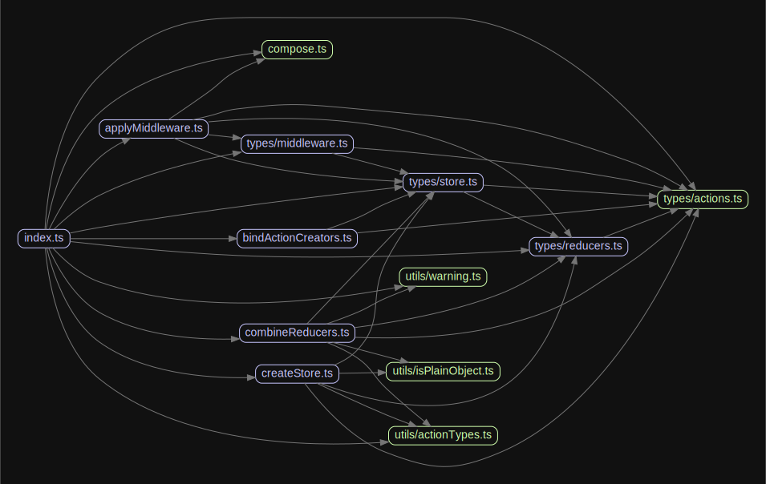

# 源码分析

## 文件结构

``` bash
/Users/liufang/openSource/FunnyLiu/redux
├── src
|  ├── applyMiddleware.ts
|  ├── bindActionCreators.ts
|  ├── combineReducers.ts
|  ├── compose.ts
|  ├── createStore.ts
|  ├── index.ts
|  ├── types
|  |  ├── actions.ts
|  |  ├── middleware.ts
|  |  ├── reducers.ts
|  |  └── store.ts
|  └── utils
|     ├── actionTypes.ts
|     ├── isPlainObject.ts
|     └── warning.ts
```

## 外部模块依赖

请在： http://npm.broofa.com?q=redux 查看

## 内部模块依赖


  